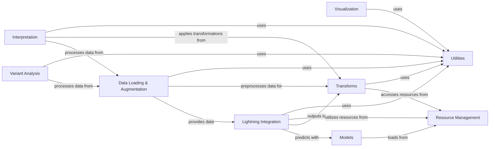

## Component Details

The system is designed for genomic sequence analysis, focusing on predicting and interpreting the effects of genetic variants. It encompasses modules for data loading and augmentation, deep learning model integration (including pre-trained models like Borzoi and Enformer), and various transformation utilities for both input sequences and model predictions/labels. The system also provides functionalities for visualizing results and interpreting model outputs, such as identifying important DNA regions. Resource management handles the retrieval of external assets like models and datasets, ensuring a streamlined workflow for genomic research.

### Utilities
This component provides a collection of general-purpose utility functions used across the gReLU project. These functions handle common operations such as aggregating values, comparing data, transforming data (e.g., log transformations), and converting various data types into lists. It acts as a foundational layer, offering reusable helper methods to other components.

**Related Classes/Methods**:

- <a href="https://github.com/Genentech/gReLU/blob/master/src/grelu/utils.py#L63-L93" target="_blank" rel="noopener noreferrer">`grelu.utils.get_compare_func` (63:93)</a>
- <a href="https://github.com/Genentech/gReLU/blob/master/src/grelu/utils.py#L128-L154" target="_blank" rel="noopener noreferrer">`grelu.utils.make_list` (128:154)</a>
- <a href="https://github.com/Genentech/gReLU/blob/master/src/grelu/utils.py#L29-L60" target="_blank" rel="noopener noreferrer">`grelu.utils.get_aggfunc` (29:60)</a>
- <a href="https://github.com/Genentech/gReLU/blob/master/src/grelu/utils.py#L96-L125" target="_blank" rel="noopener noreferrer">`grelu.utils.get_transform_func` (96:125)</a>

### Variant Analysis
The Variant Analysis component is responsible for processing and predicting the effects of genetic variants. It includes functionalities for filtering variants, converting them into genomic intervals, and performing predictions and marginalization experiments using trained models. This component leverages data loading capabilities and utility functions for its operations.

**Related Classes/Methods**:

- <a href="https://github.com/Genentech/gReLU/blob/master/src/grelu/variant.py#L185-L275" target="_blank" rel="noopener noreferrer">`gReLU.src.grelu.variant:predict_variant_effects` (185:275)</a>
- <a href="https://github.com/Genentech/gReLU/blob/master/src/grelu/variant.py#L278-L397" target="_blank" rel="noopener noreferrer">`gReLU.src.grelu.variant:marginalize_variants` (278:397)</a>

### Visualization
This component focuses on generating various plots and visualizations to represent data and model predictions. It includes functions for plotting distributions, scatter plots, calibration curves, and attention matrices. It relies on utility functions to prepare data for plotting.

**Related Classes/Methods**:

- <a href="https://github.com/Genentech/gReLU/blob/master/src/grelu/visualize.py#L20-L79" target="_blank" rel="noopener noreferrer">`gReLU.src.grelu.visualize:_collect_preds_and_labels` (20:79)</a>
- <a href="https://github.com/Genentech/gReLU/blob/master/src/grelu/visualize.py#L82-L120" target="_blank" rel="noopener noreferrer">`gReLU.src.grelu.visualize:plot_distribution` (82:120)</a>
- <a href="https://github.com/Genentech/gReLU/blob/master/src/grelu/visualize.py#L306-L357" target="_blank" rel="noopener noreferrer">`gReLU.src.grelu.visualize:add_highlights` (306:357)</a>
- <a href="https://github.com/Genentech/gReLU/blob/master/src/grelu/visualize.py#L586-L700" target="_blank" rel="noopener noreferrer">`gReLU.src.grelu.visualize:plot_tracks` (586:700)</a>

### Interpretation
The Interpretation component provides methods to understand and score the importance of individual DNA bases or regions based on a trained model's predictions. This includes techniques like In Silico Mutagenesis (ISM) and attribution methods. It interacts with data loading and utility components to perform its analysis.

**Related Classes/Methods**:

- <a href="https://github.com/Genentech/gReLU/blob/master/src/grelu/interpret/score.py#L23-L122" target="_blank" rel="noopener noreferrer">`gReLU.src.grelu.interpret.score:ISM_predict` (23:122)</a>
- <a href="https://github.com/Genentech/gReLU/blob/master/src/grelu/interpret/motifs.py#L19-L71" target="_blank" rel="noopener noreferrer">`gReLU.src.grelu.interpret.motifs:motifs_to_strings` (19:71)</a>
- <a href="https://github.com/Genentech/gReLU/blob/master/src/grelu/interpret/motifs.py#L113-L214" target="_blank" rel="noopener noreferrer">`gReLU.src.grelu.interpret.motifs:scan_sequences` (113:214)</a>
- <a href="https://github.com/Genentech/gReLU/blob/master/src/grelu/interpret/motifs.py#L217-L251" target="_blank" rel="noopener noreferrer">`gReLU.src.grelu.interpret.motifs:score_sites` (217:251)</a>
- <a href="https://github.com/Genentech/gReLU/blob/master/src/grelu/interpret/simulate.py#L9-L87" target="_blank" rel="noopener noreferrer">`gReLU.src.grelu.interpret.simulate:marginalize_patterns` (9:87)</a>
- <a href="https://github.com/Genentech/gReLU/blob/master/src/grelu/interpret/simulate.py#L90-L178" target="_blank" rel="noopener noreferrer">`gReLU.src.grelu.interpret.simulate:marginalize_pattern_spacing` (90:178)</a>
- <a href="https://github.com/Genentech/gReLU/blob/master/src/grelu/interpret/simulate.py#L181-L259" target="_blank" rel="noopener noreferrer">`gReLU.src.grelu.interpret.simulate:shuffle_tiles` (181:259)</a>

### Resource Management
This component is responsible for managing and retrieving external resources and artifacts, such as pre-trained models and datasets. It interacts with external services (like Weights & Biases) to download and load necessary files for the application.

**Related Classes/Methods**:

- `gReLU.src.grelu.resources:get_artifact` (full file reference)
- `gReLU.src.grelu.resources:load_model` (full file reference)
- `gReLU.src.grelu.resources._check_wandb` (full file reference)
- `gReLU.src.grelu.resources:get_dataset_by_model` (full file reference)
- `gReLU.src.grelu.resources:get_model_by_dataset` (full file reference)

### Models
The Models component defines and encapsulates various deep learning model architectures, including pre-trained models like Borzoi and Enformer. It handles the initialization and loading of model weights, often relying on the Resource Management component to fetch pre-trained artifacts.

**Related Classes/Methods**:

- <a href="https://github.com/Genentech/gReLU/blob/master/src/grelu/model/models.py#L567-L626" target="_blank" rel="noopener noreferrer">`gReLU.src.grelu.model.models.BorzoiPretrainedModel:__init__` (567:626)</a>
- <a href="https://github.com/Genentech/gReLU/blob/master/src/grelu/model/models.py#L740-L790" target="_blank" rel="noopener noreferrer">`gReLU.src.grelu.model.models.EnformerPretrainedModel:__init__` (740:790)</a>

### Lightning Integration
This component integrates the deep learning models with PyTorch Lightning, providing functionalities for parsing devices, predicting on datasets, and managing task indices. It acts as an interface between the core model architectures and the training/prediction pipeline.

**Related Classes/Methods**:

- `gReLU.src.grelu.lightning.LightningModel:parse_devices` (full file reference)
- `gReLU.src.grelu.lightning.LightningModel:predict_on_dataset` (full file reference)
- `gReLU.src.grelu.lightning.LightningModel:get_task_idxs` (full file reference)

### Data Loading & Augmentation
This component is responsible for loading, preprocessing, and augmenting genomic sequence data and their associated labels. It defines various dataset classes (e.g., LabeledSeqDataset, VariantDataset) that handle different data formats and augmentation strategies, preparing the data for model input.

**Related Classes/Methods**:

- <a href="https://github.com/Genentech/gReLU/blob/master/src/grelu/data/preprocess.py#L73-L142" target="_blank" rel="noopener noreferrer">`gReLU.src.grelu.data.preprocess:filter_coverage` (73:142)</a>
- <a href="https://github.com/Genentech/gReLU/blob/master/src/grelu/data/dataset.py#L72-L156" target="_blank" rel="noopener noreferrer">`gReLU.src.grelu.data.dataset.LabeledSeqDataset:__init__` (72:156)</a>
- <a href="https://github.com/Genentech/gReLU/blob/master/src/grelu/data/dataset.py#L178-L197" target="_blank" rel="noopener noreferrer">`gReLU.src.grelu.data.dataset.LabeledSeqDataset:get_labels` (178:197)</a>
- <a href="https://github.com/Genentech/gReLU/blob/master/src/grelu/data/dataset.py#L199-L228" target="_blank" rel="noopener noreferrer">`gReLU.src.grelu.data.dataset.LabeledSeqDataset:__getitem__` (199:228)</a>

### Transforms
This component provides various transformations applied to data, labels, and model predictions. It includes functionalities for aggregating prediction outputs, calculating specific metrics, clipping label values, and scoring patterns within genomic sequences. These transformations prepare data for model input, refine model outputs, or facilitate further analysis.

**Related Classes/Methods**:

- <a href="https://github.com/Genentech/gReLU/blob/master/src/grelu/transforms/prediction_transforms.py#L39-L92" target="_blank" rel="noopener noreferrer">`gReLU.src.grelu.transforms.prediction_transforms.Aggregate:__init__` (39:92)</a>
- <a href="https://github.com/Genentech/gReLU/blob/master/src/grelu/transforms/prediction_transforms.py#L184-L220" target="_blank" rel="noopener noreferrer">`gReLU.src.grelu.transforms.prediction_transforms.Specificity:__init__` (184:220)</a>
- <a href="https://github.com/Genentech/gReLU/blob/master/src/grelu/transforms/prediction_transforms.py#L231-L241" target="_blank" rel="noopener noreferrer">`gReLU.src.grelu.transforms.prediction_transforms.Specificity:forward` (231:241)</a>
- <a href="https://github.com/Genentech/gReLU/blob/master/src/grelu/transforms/prediction_transforms.py#L243-L250" target="_blank" rel="noopener noreferrer">`gReLU.src.grelu.transforms.prediction_transforms.Specificity:compute` (243:250)</a>
- <a href="https://github.com/Genentech/gReLU/blob/master/src/grelu/transforms/label_transforms.py#L25-L33" target="_blank" rel="noopener noreferrer">`gReLU.src.grelu.transforms.label_transforms.LabelTransform:__init__` (25:33)</a>
- <a href="https://github.com/Genentech/gReLU/blob/master/src/grelu/transforms/label_transforms.py#L51-L52" target="_blank" rel="noopener noreferrer">`gReLU.src.grelu.transforms.label_transforms.LabelTransform:__call__` (51:52)</a>
- <a href="https://github.com/Genentech/gReLU/blob/master/src/grelu/transforms/seq_transforms.py#L54-L55" target="_blank" rel="noopener noreferrer">`gReLU.src.grelu.transforms.seq_transforms.PatternScore:__call__` (54:55)</a>

### [FAQ](https://github.com/CodeBoarding/GeneratedOnBoardings/tree/main?tab=readme-ov-file#faq)