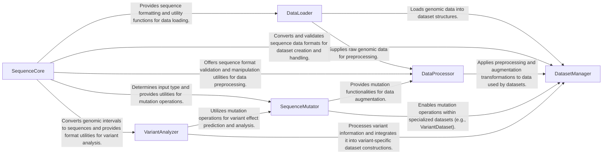

## Component Details

The Data Management & Preparation component is responsible for handling all aspects of biological sequence data within the gReLU project. This includes reading raw sequence data from various file formats, performing basic manipulations, augmenting data for increased diversity, processing genetic variants, and providing abstract dataset interfaces that can be consumed by models. It ensures data consistency, prepares sequences for downstream tasks, and facilitates specialized analyses like variant effect prediction and motif scanning.

### SequenceCore
Provides fundamental functionalities for handling DNA sequences, including format validation (intervals, strings, indices, one-hot), conversion between these formats, and utility functions like padding, trimming, reversing complements, and shuffling. It ensures data consistency and prepares sequences for various downstream tasks.

**Related Classes/Methods**:

- <a href="https://github.com/Genentech/gReLU/blob/master/src/grelu/sequence/format.py#L32-L52" target="_blank" rel="noopener noreferrer">`grelu.sequence.format:check_intervals` (32:52)</a>
- <a href="https://github.com/Genentech/gReLU/blob/master/src/grelu/sequence/format.py#L55-L66" target="_blank" rel="noopener noreferrer">`grelu.sequence.format:check_string_dna` (55:66)</a>
- <a href="https://github.com/Genentech/gReLU/blob/master/src/grelu/sequence/format.py#L69-L88" target="_blank" rel="noopener noreferrer">`grelu.sequence.format:check_indices` (69:88)</a>
- <a href="https://github.com/Genentech/gReLU/blob/master/src/grelu/sequence/format.py#L91-L110" target="_blank" rel="noopener noreferrer">`grelu.sequence.format:check_one_hot` (91:110)</a>
- <a href="https://github.com/Genentech/gReLU/blob/master/src/grelu/sequence/format.py#L113-L157" target="_blank" rel="noopener noreferrer">`grelu.sequence.format:get_input_type` (113:157)</a>
- <a href="https://github.com/Genentech/gReLU/blob/master/src/grelu/sequence/format.py#L160-L221" target="_blank" rel="noopener noreferrer">`grelu.sequence.format:intervals_to_strings` (160:221)</a>
- <a href="https://github.com/Genentech/gReLU/blob/master/src/grelu/sequence/format.py#L224-L260" target="_blank" rel="noopener noreferrer">`grelu.sequence.format:strings_to_indices` (224:260)</a>
- <a href="https://github.com/Genentech/gReLU/blob/master/src/grelu/sequence/format.py#L263-L294" target="_blank" rel="noopener noreferrer">`grelu.sequence.format:indices_to_one_hot` (263:294)</a>
- <a href="https://github.com/Genentech/gReLU/blob/master/src/grelu/sequence/format.py#L297-L320" target="_blank" rel="noopener noreferrer">`grelu.sequence.format:strings_to_one_hot` (297:320)</a>
- <a href="https://github.com/Genentech/gReLU/blob/master/src/grelu/sequence/format.py#L323-L339" target="_blank" rel="noopener noreferrer">`grelu.sequence.format:one_hot_to_indices` (323:339)</a>
- <a href="https://github.com/Genentech/gReLU/blob/master/src/grelu/sequence/format.py#L342-L353" target="_blank" rel="noopener noreferrer">`grelu.sequence.format:one_hot_to_strings` (342:353)</a>
- <a href="https://github.com/Genentech/gReLU/blob/master/src/grelu/sequence/format.py#L356-L372" target="_blank" rel="noopener noreferrer">`grelu.sequence.format:indices_to_strings` (356:372)</a>
- <a href="https://github.com/Genentech/gReLU/blob/master/src/grelu/sequence/format.py#L375-L440" target="_blank" rel="noopener noreferrer">`grelu.sequence.format:convert_input_type` (375:440)</a>
- <a href="https://github.com/Genentech/gReLU/blob/master/src/grelu/sequence/utils.py#L24-L66" target="_blank" rel="noopener noreferrer">`grelu.sequence.utils:get_lengths` (24:66)</a>
- <a href="https://github.com/Genentech/gReLU/blob/master/src/grelu/sequence/utils.py#L69-L83" target="_blank" rel="noopener noreferrer">`grelu.sequence.utils:check_equal_lengths` (69:83)</a>
- <a href="https://github.com/Genentech/gReLU/blob/master/src/grelu/sequence/utils.py#L86-L103" target="_blank" rel="noopener noreferrer">`grelu.sequence.utils:get_unique_length` (86:103)</a>
- <a href="https://github.com/Genentech/gReLU/blob/master/src/grelu/sequence/utils.py#L106-L189" target="_blank" rel="noopener noreferrer">`grelu.sequence.utils:pad` (106:189)</a>
- <a href="https://github.com/Genentech/gReLU/blob/master/src/grelu/sequence/utils.py#L192-L260" target="_blank" rel="noopener noreferrer">`grelu.sequence.utils:trim` (192:260)</a>
- <a href="https://github.com/Genentech/gReLU/blob/master/src/grelu/sequence/utils.py#L263-L332" target="_blank" rel="noopener noreferrer">`grelu.sequence.utils:resize` (263:332)</a>
- <a href="https://github.com/Genentech/gReLU/blob/master/src/grelu/sequence/utils.py#L335-L372" target="_blank" rel="noopener noreferrer">`grelu.sequence.utils:reverse_complement` (335:372)</a>
- <a href="https://github.com/Genentech/gReLU/blob/master/src/grelu/sequence/utils.py#L375-L415" target="_blank" rel="noopener noreferrer">`grelu.sequence.utils:dinuc_shuffle` (375:415)</a>
- <a href="https://github.com/Genentech/gReLU/blob/master/src/grelu/sequence/utils.py#L418-L444" target="_blank" rel="noopener noreferrer">`grelu.sequence.utils:generate_random_sequences` (418:444)</a>
- <a href="https://github.com/Genentech/gReLU/blob/master/src/grelu/sequence/metrics.py#L14-L62" target="_blank" rel="noopener noreferrer">`grelu.sequence.metrics:gc` (14:62)</a>

### DataLoader
Responsible for reading and managing various types of genomic and sequence data from different file formats (FASTA, BigWig, BED) and integrating with genome information. It provides the foundational data structures for other components to operate on.

**Related Classes/Methods**:

- <a href="https://github.com/Genentech/gReLU/blob/master/src/grelu/io/fasta.py#L29-L50" target="_blank" rel="noopener noreferrer">`grelu.io.fasta:read_fasta` (29:50)</a>
- <a href="https://github.com/Genentech/gReLU/blob/master/src/grelu/io/fasta.py#L11-L26" target="_blank" rel="noopener noreferrer">`grelu.io.fasta:check_fasta` (11:26)</a>
- <a href="https://github.com/Genentech/gReLU/blob/master/src/grelu/io/genome.py#L13-L33" target="_blank" rel="noopener noreferrer">`grelu.io.genome:read_sizes` (13:33)</a>
- <a href="https://github.com/Genentech/gReLU/blob/master/src/grelu/io/genome.py#L36-L50" target="_blank" rel="noopener noreferrer">`grelu.io.genome:get_genome` (36:50)</a>
- <a href="https://github.com/Genentech/gReLU/blob/master/src/grelu/io/bigwig.py#L31-L99" target="_blank" rel="noopener noreferrer">`grelu.io.bigwig:read_bigwig` (31:99)</a>
- <a href="https://github.com/Genentech/gReLU/blob/master/src/grelu/io/bigwig.py#L13-L28" target="_blank" rel="noopener noreferrer">`grelu.io.bigwig:check_bigwig` (13:28)</a>
- `grelu.io.bed` (full file reference)

### DataProcessor
Handles the preparation and enhancement of raw sequence data. It includes functionalities for filtering sequences based on various criteria (coverage, chromosomes, blacklist, overlaps) and augmenting data through random mutations or reverse complementation to increase dataset diversity.

**Related Classes/Methods**:

- <a href="https://github.com/Genentech/gReLU/blob/master/src/grelu/data/preprocess.py#L73-L142" target="_blank" rel="noopener noreferrer">`grelu.data.preprocess:filter_coverage` (73:142)</a>
- <a href="https://github.com/Genentech/gReLU/blob/master/src/grelu/data/preprocess.py#L145-L167" target="_blank" rel="noopener noreferrer">`grelu.data.preprocess:filter_cells` (145:167)</a>
- <a href="https://github.com/Genentech/gReLU/blob/master/src/grelu/data/preprocess.py#L172-L202" target="_blank" rel="noopener noreferrer">`grelu.data.preprocess:filter_random` (172:202)</a>
- <a href="https://github.com/Genentech/gReLU/blob/master/src/grelu/data/preprocess.py#L205-L242" target="_blank" rel="noopener noreferrer">`grelu.data.preprocess:filter_chromosomes` (205:242)</a>
- <a href="https://github.com/Genentech/gReLU/blob/master/src/grelu/data/preprocess.py#L274-L334" target="_blank" rel="noopener noreferrer">`grelu.data.preprocess:filter_overlapping` (274:334)</a>
- <a href="https://github.com/Genentech/gReLU/blob/master/src/grelu/data/preprocess.py#L337-L377" target="_blank" rel="noopener noreferrer">`grelu.data.preprocess:filter_blacklist` (337:377)</a>
- <a href="https://github.com/Genentech/gReLU/blob/master/src/grelu/data/preprocess.py#L380-L422" target="_blank" rel="noopener noreferrer">`grelu.data.preprocess:check_chrom_ends` (380:422)</a>
- <a href="https://github.com/Genentech/gReLU/blob/master/src/grelu/data/preprocess.py#L425-L464" target="_blank" rel="noopener noreferrer">`grelu.data.preprocess:filter_chrom_ends` (425:464)</a>
- <a href="https://github.com/Genentech/gReLU/blob/master/src/grelu/data/preprocess.py#L467-L527" target="_blank" rel="noopener noreferrer">`grelu.data.preprocess:split` (467:527)</a>
- <a href="https://github.com/Genentech/gReLU/blob/master/src/grelu/data/preprocess.py#L530-L579" target="_blank" rel="noopener noreferrer">`grelu.data.preprocess:get_gc_matched_intervals` (530:579)</a>
- <a href="https://github.com/Genentech/gReLU/blob/master/src/grelu/data/preprocess.py#L706-L776" target="_blank" rel="noopener noreferrer">`grelu.data.preprocess:make_insertion_bigwig` (706:776)</a>
- <a href="https://github.com/Genentech/gReLU/blob/master/src/grelu/data/utils.py#L36-L65" target="_blank" rel="noopener noreferrer">`grelu.data.utils:get_chromosomes` (36:65)</a>
- <a href="https://github.com/Genentech/gReLU/blob/master/src/grelu/data/utils.py#L68-L94" target="_blank" rel="noopener noreferrer">`grelu.data.utils:_tile_positions` (68:94)</a>
- <a href="https://github.com/Genentech/gReLU/blob/master/src/grelu/data/augment.py#L65-L77" target="_blank" rel="noopener noreferrer">`grelu.data.augment:rc_seq` (65:77)</a>
- <a href="https://github.com/Genentech/gReLU/blob/master/src/grelu/data/augment.py#L80-L92" target="_blank" rel="noopener noreferrer">`grelu.data.augment:rc_label` (80:92)</a>
- <a href="https://github.com/Genentech/gReLU/blob/master/src/grelu/data/augment.py#L116-L166" target="_blank" rel="noopener noreferrer">`grelu.data.augment.Augmenter:__init__` (116:166)</a>
- <a href="https://github.com/Genentech/gReLU/blob/master/src/grelu/data/augment.py#L188-L245" target="_blank" rel="noopener noreferrer">`grelu.data.augment.Augmenter:__call__` (188:245)</a>
- <a href="https://github.com/Genentech/gReLU/blob/master/src/grelu/data/augment.py#L34-L35" target="_blank" rel="noopener noreferrer">`grelu.data.augment._get_multipliers` (34:35)</a>
- <a href="https://github.com/Genentech/gReLU/blob/master/src/grelu/data/augment.py#L38-L47" target="_blank" rel="noopener noreferrer">`grelu.data.augment._split_overall_idx` (38:47)</a>

### DatasetManager
Defines and manages various specialized dataset classes for different types of sequence analysis tasks. These datasets handle the loading, resizing, and batching of sequences, often incorporating data augmentation and specific logic for variants, motifs, or marginalization experiments.

**Related Classes/Methods**:

- <a href="https://github.com/Genentech/gReLU/blob/master/src/grelu/data/dataset.py#L72-L156" target="_blank" rel="noopener noreferrer">`grelu.data.dataset.LabeledSeqDataset:__init__` (72:156)</a>
- <a href="https://github.com/Genentech/gReLU/blob/master/src/grelu/data/dataset.py#L158-L165" target="_blank" rel="noopener noreferrer">`grelu.data.dataset.LabeledSeqDataset:_load_seqs` (158:165)</a>
- <a href="https://github.com/Genentech/gReLU/blob/master/src/grelu/data/dataset.py#L167-L170" target="_blank" rel="noopener noreferrer">`grelu.data.dataset.LabeledSeqDataset:_load_tasks` (167:170)</a>
- <a href="https://github.com/Genentech/gReLU/blob/master/src/grelu/data/dataset.py#L172-L173" target="_blank" rel="noopener noreferrer">`grelu.data.dataset.LabeledSeqDataset:_load_labels` (172:173)</a>
- <a href="https://github.com/Genentech/gReLU/blob/master/src/grelu/data/dataset.py#L199-L228" target="_blank" rel="noopener noreferrer">`grelu.data.dataset.LabeledSeqDataset:__getitem__` (199:228)</a>
- <a href="https://github.com/Genentech/gReLU/blob/master/src/grelu/data/dataset.py#L252-L300" target="_blank" rel="noopener noreferrer">`grelu.data.dataset.DFSeqDataset:__init__` (252:300)</a>
- <a href="https://github.com/Genentech/gReLU/blob/master/src/grelu/data/dataset.py#L321-L366" target="_blank" rel="noopener noreferrer">`grelu.data.dataset.AnnDataSeqDataset:__init__` (321:366)</a>
- <a href="https://github.com/Genentech/gReLU/blob/master/src/grelu/data/dataset.py#L397-L438" target="_blank" rel="noopener noreferrer">`grelu.data.dataset.BigWigSeqDataset:__init__` (397:438)</a>
- <a href="https://github.com/Genentech/gReLU/blob/master/src/grelu/data/dataset.py#L440-L449" target="_blank" rel="noopener noreferrer">`grelu.data.dataset.BigWigSeqDataset:_load_labels` (440:449)</a>
- <a href="https://github.com/Genentech/gReLU/blob/master/src/grelu/data/dataset.py#L471-L509" target="_blank" rel="noopener noreferrer">`grelu.data.dataset.SeqDataset:__init__` (471:509)</a>
- <a href="https://github.com/Genentech/gReLU/blob/master/src/grelu/data/dataset.py#L511-L517" target="_blank" rel="noopener noreferrer">`grelu.data.dataset.SeqDataset:_load_seqs` (511:517)</a>
- <a href="https://github.com/Genentech/gReLU/blob/master/src/grelu/data/dataset.py#L522-L530" target="_blank" rel="noopener noreferrer">`grelu.data.dataset.SeqDataset:__getitem__` (522:530)</a>
- <a href="https://github.com/Genentech/gReLU/blob/master/src/grelu/data/dataset.py#L548-L582" target="_blank" rel="noopener noreferrer">`grelu.data.dataset.VariantDataset:__init__` (548:582)</a>
- <a href="https://github.com/Genentech/gReLU/blob/master/src/grelu/data/dataset.py#L584-L586" target="_blank" rel="noopener noreferrer">`grelu.data.dataset.VariantDataset:_load_alleles` (584:586)</a>
- <a href="https://github.com/Genentech/gReLU/blob/master/src/grelu/data/dataset.py#L588-L596" target="_blank" rel="noopener noreferrer">`grelu.data.dataset.VariantDataset:_load_seqs` (588:596)</a>
- <a href="https://github.com/Genentech/gReLU/blob/master/src/grelu/data/dataset.py#L601-L622" target="_blank" rel="noopener noreferrer">`grelu.data.dataset.VariantDataset:__getitem__` (601:622)</a>
- <a href="https://github.com/Genentech/gReLU/blob/master/src/grelu/data/dataset.py#L645-L685" target="_blank" rel="noopener noreferrer">`grelu.data.dataset.VariantMarginalizeDataset:__init__` (645:685)</a>
- <a href="https://github.com/Genentech/gReLU/blob/master/src/grelu/data/dataset.py#L687-L693" target="_blank" rel="noopener noreferrer">`grelu.data.dataset.VariantMarginalizeDataset:_load_alleles` (687:693)</a>
- <a href="https://github.com/Genentech/gReLU/blob/master/src/grelu/data/dataset.py#L695-L707" target="_blank" rel="noopener noreferrer">`grelu.data.dataset.VariantMarginalizeDataset:_load_seqs` (695:707)</a>
- <a href="https://github.com/Genentech/gReLU/blob/master/src/grelu/data/dataset.py#L709-L720" target="_blank" rel="noopener noreferrer">`grelu.data.dataset.VariantMarginalizeDataset:__update__` (709:720)</a>
- <a href="https://github.com/Genentech/gReLU/blob/master/src/grelu/data/dataset.py#L725-L749" target="_blank" rel="noopener noreferrer">`grelu.data.dataset.VariantMarginalizeDataset:__getitem__` (725:749)</a>
- <a href="https://github.com/Genentech/gReLU/blob/master/src/grelu/data/dataset.py#L771-L811" target="_blank" rel="noopener noreferrer">`grelu.data.dataset.PatternMarginalizeDataset:__init__` (771:811)</a>
- <a href="https://github.com/Genentech/gReLU/blob/master/src/grelu/data/dataset.py#L813-L815" target="_blank" rel="noopener noreferrer">`grelu.data.dataset.PatternMarginalizeDataset:_load_alleles` (813:815)</a>
- <a href="https://github.com/Genentech/gReLU/blob/master/src/grelu/data/dataset.py#L817-L828" target="_blank" rel="noopener noreferrer">`grelu.data.dataset.PatternMarginalizeDataset:_load_seqs` (817:828)</a>
- <a href="https://github.com/Genentech/gReLU/blob/master/src/grelu/data/dataset.py#L830-L841" target="_blank" rel="noopener noreferrer">`grelu.data.dataset.PatternMarginalizeDataset:__update__` (830:841)</a>
- <a href="https://github.com/Genentech/gReLU/blob/master/src/grelu/data/dataset.py#L846-L866" target="_blank" rel="noopener noreferrer">`grelu.data.dataset.PatternMarginalizeDataset:__getitem__` (846:866)</a>
- <a href="https://github.com/Genentech/gReLU/blob/master/src/grelu/data/dataset.py#L883-L904" target="_blank" rel="noopener noreferrer">`grelu.data.dataset.ISMDataset:__init__` (883:904)</a>
- <a href="https://github.com/Genentech/gReLU/blob/master/src/grelu/data/dataset.py#L906-L909" target="_blank" rel="noopener noreferrer">`grelu.data.dataset.ISMDataset:_load_seqs` (906:909)</a>
- <a href="https://github.com/Genentech/gReLU/blob/master/src/grelu/data/dataset.py#L914-L938" target="_blank" rel="noopener noreferrer">`grelu.data.dataset.ISMDataset:__getitem__` (914:938)</a>
- <a href="https://github.com/Genentech/gReLU/blob/master/src/grelu/data/dataset.py#L955-L983" target="_blank" rel="noopener noreferrer">`grelu.data.dataset.MotifScanDataset:__init__` (955:983)</a>
- <a href="https://github.com/Genentech/gReLU/blob/master/src/grelu/data/dataset.py#L985-L988" target="_blank" rel="noopener noreferrer">`grelu.data.dataset.MotifScanDataset:_load_seqs` (985:988)</a>
- <a href="https://github.com/Genentech/gReLU/blob/master/src/grelu/data/dataset.py#L993-L1000" target="_blank" rel="noopener noreferrer">`grelu.data.dataset.MotifScanDataset:__getitem__` (993:1000)</a>
- `grelu.data.dataset.SpacingMarginalizeDataset:__init__` (full file reference)
- `grelu.data.dataset.SpacingMarginalizeDataset:_load_seqs` (full file reference)
- `grelu.data.dataset.SpacingMarginalizeDataset:_load_patterns` (full file reference)
- `grelu.data.dataset.SpacingMarginalizeDataset:__update__` (full file reference)
- `grelu.data.dataset.SpacingMarginalizeDataset:__getitem__` (full file reference)
- `grelu.data.dataset.TilingShuffleDataset:__init__` (full file reference)
- `grelu.data.dataset.TilingShuffleDataset:_load_seqs` (full file reference)
- `grelu.data.dataset.TilingShuffleDataset:__getitem__` (full file reference)

### SequenceMutator
Provides core functionalities for modifying DNA sequences. It includes methods for general mutation, insertion, deletion, and random mutation, which are crucial for variant analysis, sequence design, and data augmentation.

**Related Classes/Methods**:

- <a href="https://github.com/Genentech/gReLU/blob/master/src/grelu/sequence/mutate.py#L12-L57" target="_blank" rel="noopener noreferrer">`grelu.sequence.mutate:mutate` (12:57)</a>
- <a href="https://github.com/Genentech/gReLU/blob/master/src/grelu/sequence/mutate.py#L60-L114" target="_blank" rel="noopener noreferrer">`grelu.sequence.mutate:insert` (60:114)</a>
- <a href="https://github.com/Genentech/gReLU/blob/master/src/grelu/sequence/mutate.py#L117-L167" target="_blank" rel="noopener noreferrer">`grelu.sequence.mutate:delete` (117:167)</a>
- <a href="https://github.com/Genentech/gReLU/blob/master/src/grelu/sequence/mutate.py#L170-L224" target="_blank" rel="noopener noreferrer">`grelu.sequence.mutate:random_mutate` (170:224)</a>

### VariantAnalyzer
Focuses on functionalities related to genetic variants. It includes methods for converting variants to sequences, checking references, predicting variant effects, and marginalizing variants for analysis.

**Related Classes/Methods**:

- <a href="https://github.com/Genentech/gReLU/blob/master/src/grelu/variant.py#L104-L139" target="_blank" rel="noopener noreferrer">`grelu.variant:variant_to_seqs` (104:139)</a>
- <a href="https://github.com/Genentech/gReLU/blob/master/src/grelu/variant.py#L142-L182" target="_blank" rel="noopener noreferrer">`grelu.variant:check_reference` (142:182)</a>
- <a href="https://github.com/Genentech/gReLU/blob/master/src/grelu/variant.py#L185-L275" target="_blank" rel="noopener noreferrer">`grelu.variant:predict_variant_effects` (185:275)</a>
- <a href="https://github.com/Genentech/gReLU/blob/master/src/grelu/variant.py#L278-L397" target="_blank" rel="noopener noreferrer">`grelu.variant:marginalize_variants` (278:397)</a>
- <a href="https://github.com/Genentech/gReLU/blob/master/src/grelu/variant.py#L74-L101" target="_blank" rel="noopener noreferrer">`grelu.variant:variants_to_intervals` (74:101)</a>

### [FAQ](https://github.com/CodeBoarding/GeneratedOnBoardings/tree/main?tab=readme-ov-file#faq)