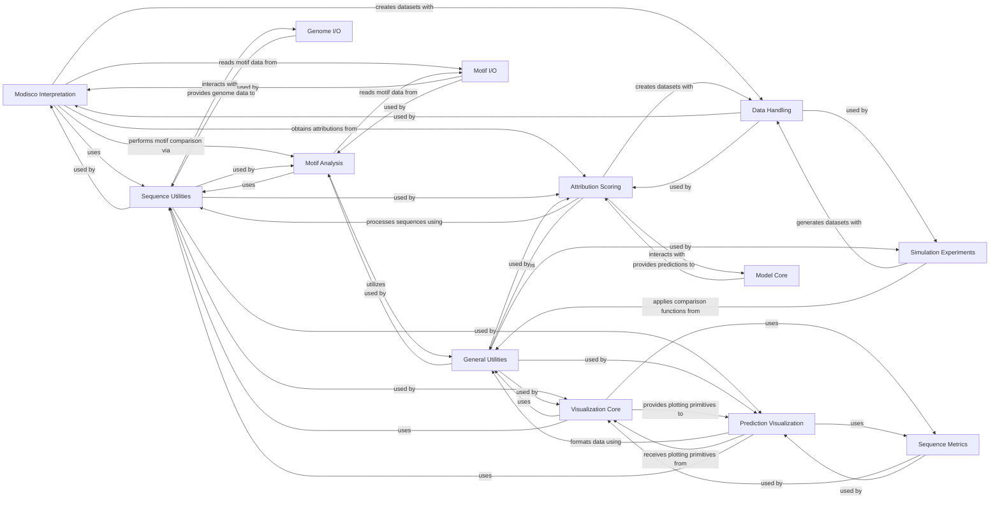

## Component Details

The Model Analysis & Visualization component provides a comprehensive set of tools for interpreting and visualizing the behavior of trained models, particularly in the context of sequence analysis. Its main flow involves generating various types of attribution scores (e.g., ISM, DeepSHAP) and sequence feature analyses (e.g., MoDISco for motif discovery, motif scanning), which are then used to produce diverse visual representations such as attribution plots, ISM plots, prediction distributions, and genomic tracks. The purpose of this component is to enable researchers to gain insights into how models make predictions, identify important sequence features, and effectively communicate their findings through rich visualizations.

### Modisco Interpretation
This component is responsible for running TF-MoDISco to discover sequence motifs from input sequences and a trained model. It also handles the optional comparison of identified motifs with a reference set using TOMTOM.

**Related Classes/Methods**:

- <a href="https://github.com/Genentech/gReLU/blob/master/src/grelu/interpret/modisco.py#L188-L339" target="_blank" rel="noopener noreferrer">`grelu.interpret.modisco:run_modisco` (188:339)</a>
- <a href="https://github.com/Genentech/gReLU/blob/master/src/grelu/interpret/modisco.py#L15-L66" target="_blank" rel="noopener noreferrer">`grelu.interpret.modisco._ism_attrs` (15:66)</a>
- <a href="https://github.com/Genentech/gReLU/blob/master/src/grelu/interpret/modisco.py#L163-L185" target="_blank" rel="noopener noreferrer">`grelu.interpret.modisco._tomtom_on_modisco` (163:185)</a>

### Motif Analysis
This component provides functionalities for manipulating sequence motifs, scanning DNA sequences with motifs to identify binding sites, and comparing motifs using the TOMTOM algorithm.

**Related Classes/Methods**:

- <a href="https://github.com/Genentech/gReLU/blob/master/src/grelu/interpret/motifs.py#L113-L214" target="_blank" rel="noopener noreferrer">`grelu.interpret.motifs:scan_sequences` (113:214)</a>
- <a href="https://github.com/Genentech/gReLU/blob/master/src/grelu/interpret/motifs.py#L369-L411" target="_blank" rel="noopener noreferrer">`grelu.interpret.motifs:run_tomtom` (369:411)</a>
- <a href="https://github.com/Genentech/gReLU/blob/master/src/grelu/interpret/motifs.py#L217-L251" target="_blank" rel="noopener noreferrer">`grelu.interpret.motifs.score_sites` (217:251)</a>
- <a href="https://github.com/Genentech/gReLU/blob/master/src/grelu/interpret/motifs.py#L254-L301" target="_blank" rel="noopener noreferrer">`grelu.interpret.motifs.score_motifs` (254:301)</a>
- <a href="https://github.com/Genentech/gReLU/blob/master/src/grelu/interpret/motifs.py#L19-L71" target="_blank" rel="noopener noreferrer">`grelu.interpret.motifs.motifs_to_strings` (19:71)</a>

### Attribution Scoring
This component calculates per-nucleotide importance scores for DNA sequences using various attribution methods, including In Silico Mutagenesis (ISM), DeepSHAP, Saliency, InputXGradient, and IntegratedGradients.

**Related Classes/Methods**:

- <a href="https://github.com/Genentech/gReLU/blob/master/src/grelu/interpret/score.py#L23-L122" target="_blank" rel="noopener noreferrer">`grelu.interpret.score:ISM_predict` (23:122)</a>
- <a href="https://github.com/Genentech/gReLU/blob/master/src/grelu/interpret/score.py#L125-L229" target="_blank" rel="noopener noreferrer">`grelu.interpret.score:get_attributions` (125:229)</a>

### Simulation Experiments
This component facilitates in-silico simulation experiments, such as marginalizing patterns to assess their impact on model predictions and analyzing the effect of spacing between patterns.

**Related Classes/Methods**:

- <a href="https://github.com/Genentech/gReLU/blob/master/src/grelu/interpret/simulate.py#L9-L87" target="_blank" rel="noopener noreferrer">`grelu.interpret.simulate:marginalize_patterns` (9:87)</a>

### Sequence Utilities
This component provides core utility functions for handling and formatting DNA sequences, including converting input types and determining unique sequence lengths.

**Related Classes/Methods**:

- <a href="https://github.com/Genentech/gReLU/blob/master/src/grelu/sequence/utils.py#L86-L103" target="_blank" rel="noopener noreferrer">`grelu.sequence.utils.get_unique_length` (86:103)</a>
- <a href="https://github.com/Genentech/gReLU/blob/master/src/grelu/sequence/format.py#L375-L440" target="_blank" rel="noopener noreferrer">`grelu.sequence.format.convert_input_type` (375:440)</a>

### Data Handling
This component manages the creation and processing of specialized datasets required for model inference, particularly for In Silico Mutagenesis and pattern marginalization experiments.

**Related Classes/Methods**:

- <a href="https://github.com/Genentech/gReLU/blob/master/src/grelu/data/dataset.py#L869-L938" target="_blank" rel="noopener noreferrer">`grelu.data.dataset.ISMDataset` (869:938)</a>
- <a href="https://github.com/Genentech/gReLU/blob/master/src/grelu/data/dataset.py#L752-L866" target="_blank" rel="noopener noreferrer">`grelu.data.dataset.PatternMarginalizeDataset` (752:866)</a>

### General Utilities
This component offers a collection of general-purpose utility functions that are widely used across different modules of the gReLU system, such as list manipulation and comparison function retrieval.

**Related Classes/Methods**:

- <a href="https://github.com/Genentech/gReLU/blob/master/src/grelu/utils.py#L128-L154" target="_blank" rel="noopener noreferrer">`grelu.utils.make_list` (128:154)</a>
- <a href="https://github.com/Genentech/gReLU/blob/master/src/grelu/utils.py#L63-L93" target="_blank" rel="noopener noreferrer">`grelu.utils.get_compare_func` (63:93)</a>

### Motif I/O
This component is specifically responsible for input/output operations related to motif files, primarily focusing on reading and parsing MEME formatted motif files.

**Related Classes/Methods**:

- <a href="https://github.com/Genentech/gReLU/blob/master/src/grelu/io/motifs.py#L14-L54" target="_blank" rel="noopener noreferrer">`grelu.io.motifs.read_meme_file` (14:54)</a>

### Visualization Core
This component provides fundamental plotting capabilities and helper functions for generating visualizations, including adding highlights to plots and collecting prediction and label data for various visualization types.

**Related Classes/Methods**:

- <a href="https://github.com/Genentech/gReLU/blob/master/src/grelu/visualize.py#L446-L517" target="_blank" rel="noopener noreferrer">`grelu.visualize:plot_attributions` (446:517)</a>
- <a href="https://github.com/Genentech/gReLU/blob/master/src/grelu/visualize.py#L306-L357" target="_blank" rel="noopener noreferrer">`grelu.visualize.add_highlights` (306:357)</a>
- <a href="https://github.com/Genentech/gReLU/blob/master/src/grelu/visualize.py#L20-L79" target="_blank" rel="noopener noreferrer">`grelu.visualize._collect_preds_and_labels` (20:79)</a>

### Prediction Visualization
This component focuses on generating specific visualizations related to model predictions, such as In Silico Mutagenesis plots, prediction distributions, and genomic coverage tracks.

**Related Classes/Methods**:

- <a href="https://github.com/Genentech/gReLU/blob/master/src/grelu/visualize.py#L520-L583" target="_blank" rel="noopener noreferrer">`grelu.visualize:plot_ISM` (520:583)</a>
- <a href="https://github.com/Genentech/gReLU/blob/master/src/grelu/visualize.py#L123-L157" target="_blank" rel="noopener noreferrer">`grelu.visualize:plot_pred_distribution` (123:157)</a>
- <a href="https://github.com/Genentech/gReLU/blob/master/src/grelu/visualize.py#L586-L700" target="_blank" rel="noopener noreferrer">`grelu.visualize:plot_tracks` (586:700)</a>

### Model Core
This component encapsulates the core model architectures and functionalities for making predictions.

**Related Classes/Methods**:

- `grelu.model.models` (full file reference)

### Sequence Metrics
This component provides functions for calculating various metrics related to sequences.

**Related Classes/Methods**:

- `grelu.sequence.metrics` (full file reference)

### Genome I/O
This component handles input/output operations related to genome data.

**Related Classes/Methods**:

- `grelu.io.genome` (full file reference)

### [FAQ](https://github.com/CodeBoarding/GeneratedOnBoardings/tree/main?tab=readme-ov-file#faq)