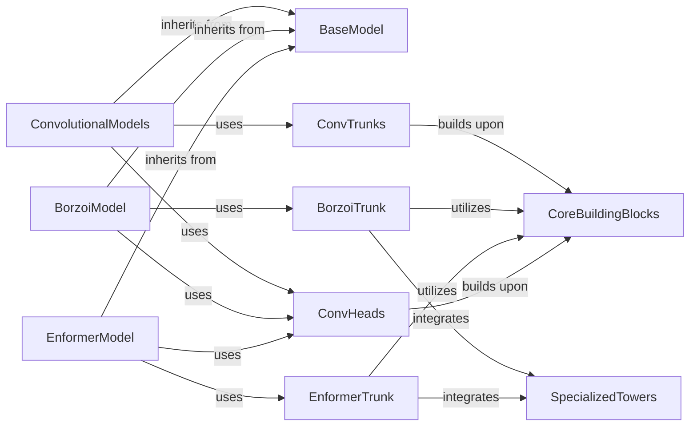

## Component Details

This component overview details the architecture of deep learning models within the `gReLU` project, focusing on how various feature extraction backbones (trunks) and output layers (heads) are combined to form complete, functional models. It highlights the foundational `BaseModel`, specialized model architectures like `BorzoiModel` and `EnformerModel`, and the reusable `CoreBuildingBlocks` that underpin these structures.

### BaseModel
The foundational class for all models in `gReLU`, inheriting from `torch.nn.Module`. It defines a common structure with an `embedding` module and a `head` module, and a `forward` pass that applies the embedding then the head.

**Related Classes/Methods**:

- <a href="https://github.com/Genentech/gReLU/blob/master/src/grelu/model/models.py#L33-L56" target="_blank" rel="noopener noreferrer">`grelu.model.models.BaseModel` (33:56)</a>

### ConvolutionalModels
A family of models primarily built with convolutional layers, often including pooling, residual connections, batch normalization, or dilated convolutions. This group includes `ConvModel`, `DilatedConvModel`, `ConvGRUModel`, `ConvTransformerModel`, and `ConvMLPModel`.

**Related Classes/Methods**:

- <a href="https://github.com/Genentech/gReLU/blob/master/src/grelu/model/models.py#L87-L143" target="_blank" rel="noopener noreferrer">`grelu.model.models.ConvModel:__init__` (87:143)</a>
- <a href="https://github.com/Genentech/gReLU/blob/master/src/grelu/model/models.py#L146-L201" target="_blank" rel="noopener noreferrer">`grelu.model.models.DilatedConvModel` (146:201)</a>
- <a href="https://github.com/Genentech/gReLU/blob/master/src/grelu/model/models.py#L204-L288" target="_blank" rel="noopener noreferrer">`grelu.model.models.ConvGRUModel` (204:288)</a>
- <a href="https://github.com/Genentech/gReLU/blob/master/src/grelu/model/models.py#L291-L390" target="_blank" rel="noopener noreferrer">`grelu.model.models.ConvTransformerModel` (291:390)</a>
- <a href="https://github.com/Genentech/gReLU/blob/master/src/grelu/model/models.py#L393-L472" target="_blank" rel="noopener noreferrer">`grelu.model.models.ConvMLPModel` (393:472)</a>

### BorzoiModel
A specific model architecture inspired by Borzoi, consisting of convolutional and transformer layers followed by U-net upsampling. It can also be loaded with pre-trained weights.

**Related Classes/Methods**:

- <a href="https://github.com/Genentech/gReLU/blob/master/src/grelu/model/models.py#L503-L559" target="_blank" rel="noopener noreferrer">`grelu.model.models.BorzoiModel:__init__` (503:559)</a>
- <a href="https://github.com/Genentech/gReLU/blob/master/src/grelu/model/models.py#L562-L626" target="_blank" rel="noopener noreferrer">`grelu.model.models.BorzoiPretrainedModel` (562:626)</a>

### EnformerModel
A model architecture based on the Enformer, featuring convolutional and transformer towers for sequence-to-function prediction. It also supports loading pre-trained weights.

**Related Classes/Methods**:

- <a href="https://github.com/Genentech/gReLU/blob/master/src/grelu/model/models.py#L665-L732" target="_blank" rel="noopener noreferrer">`grelu.model.models.EnformerModel` (665:732)</a>
- <a href="https://github.com/Genentech/gReLU/blob/master/src/grelu/model/models.py#L735-L790" target="_blank" rel="noopener noreferrer">`grelu.model.models.EnformerPretrainedModel` (735:790)</a>

### ConvTrunks
Components responsible for the initial feature extraction (embedding) using various convolutional configurations, such as standard convolutions, dilated convolutions, or combined with GRU/Transformer layers.

**Related Classes/Methods**:

- `grelu.model.trunks.ConvTrunk:__init__` (full file reference)
- `grelu.model.trunks.DilatedConvTrunk` (full file reference)
- `grelu.model.trunks.ConvGRUTrunk` (full file reference)
- `grelu.model.trunks.ConvTransformerTrunk` (full file reference)
- <a href="https://github.com/Genentech/gReLU/blob/master/src/grelu/model/trunks/explainn.py#L70-L143" target="_blank" rel="noopener noreferrer">`grelu.model.trunks.explainn.ExplaiNNTrunk` (70:143)</a>

### BorzoiTrunk
The embedding component specifically designed for the Borzoi model, incorporating Borzoi-specific convolutional, transformer, and U-net towers.

**Related Classes/Methods**:

- <a href="https://github.com/Genentech/gReLU/blob/master/src/grelu/model/trunks/borzoi.py#L129-L205" target="_blank" rel="noopener noreferrer">`grelu.model.trunks.borzoi.BorzoiTrunk:__init__` (129:205)</a>

### EnformerTrunk
The embedding component specifically designed for the Enformer model, featuring Enformer-specific convolutional and transformer towers.

**Related Classes/Methods**:

- <a href="https://github.com/Genentech/gReLU/blob/master/src/grelu/model/trunks/enformer.py#L258-L300" target="_blank" rel="noopener noreferrer">`grelu.model.trunks.enformer.EnformerTrunk:__init__` (258:300)</a>

### ConvHeads
The common output layer for many models, transforming the features extracted by the embedding trunk into task-specific predictions, often involving channel transformations and pooling. This group includes `ConvHead` and `MLPHead`.

**Related Classes/Methods**:

- <a href="https://github.com/Genentech/gReLU/blob/master/src/grelu/model/heads.py#L34-L61" target="_blank" rel="noopener noreferrer">`grelu.model.heads.ConvHead:__init__` (34:61)</a>
- <a href="https://github.com/Genentech/gReLU/blob/master/src/grelu/model/heads.py#L73-L156" target="_blank" rel="noopener noreferrer">`grelu.model.heads.MLPHead` (73:156)</a>

### CoreBuildingBlocks
Fundamental and reusable neural network layers and blocks that form the basic components of various trunks and heads. These include generic convolutional blocks, activation functions, cropping layers, and adaptive pooling.

**Related Classes/Methods**:

- <a href="https://github.com/Genentech/gReLU/blob/master/src/grelu/model/blocks.py#L426-L556" target="_blank" rel="noopener noreferrer">`grelu.model.blocks.ConvTower` (426:556)</a>
- <a href="https://github.com/Genentech/gReLU/blob/master/src/grelu/model/blocks.py#L79-L220" target="_blank" rel="noopener noreferrer">`grelu.model.blocks.ConvBlock` (79:220)</a>
- <a href="https://github.com/Genentech/gReLU/blob/master/src/grelu/model/blocks.py#L223-L318" target="_blank" rel="noopener noreferrer">`grelu.model.blocks.ChannelTransformBlock` (223:318)</a>
- <a href="https://github.com/Genentech/gReLU/blob/master/src/grelu/model/layers.py#L18-L60" target="_blank" rel="noopener noreferrer">`grelu.model.layers.Activation` (18:60)</a>
- <a href="https://github.com/Genentech/gReLU/blob/master/src/grelu/model/layers.py#L270-L305" target="_blank" rel="noopener noreferrer">`grelu.model.layers.Crop` (270:305)</a>
- <a href="https://github.com/Genentech/gReLU/blob/master/src/grelu/model/layers.py#L113-L148" target="_blank" rel="noopener noreferrer">`grelu.model.layers.AdaptivePool` (113:148)</a>

### SpecializedTowers
Complex, architecture-specific sub-components that encapsulate specialized convolutional, transformer, or U-net structures used within particular trunks.

**Related Classes/Methods**:

- <a href="https://github.com/Genentech/gReLU/blob/master/src/grelu/model/trunks/borzoi.py#L12-L99" target="_blank" rel="noopener noreferrer">`grelu.model.trunks.borzoi.BorzoiConvTower` (12:99)</a>
- <a href="https://github.com/Genentech/gReLU/blob/master/src/grelu/model/blocks.py#L780-L849" target="_blank" rel="noopener noreferrer">`grelu.model.blocks.TransformerTower` (780:849)</a>
- <a href="https://github.com/Genentech/gReLU/blob/master/src/grelu/model/blocks.py#L919-L951" target="_blank" rel="noopener noreferrer">`grelu.model.blocks.UnetTower` (919:951)</a>
- <a href="https://github.com/Genentech/gReLU/blob/master/src/grelu/model/trunks/enformer.py#L14-L101" target="_blank" rel="noopener noreferrer">`grelu.model.trunks.enformer.EnformerConvTower` (14:101)</a>
- <a href="https://github.com/Genentech/gReLU/blob/master/src/grelu/model/trunks/enformer.py#L175-L236" target="_blank" rel="noopener noreferrer">`grelu.model.trunks.enformer.EnformerTransformerTower` (175:236)</a>

### [FAQ](https://github.com/CodeBoarding/GeneratedOnBoardings/tree/main?tab=readme-ov-file#faq)