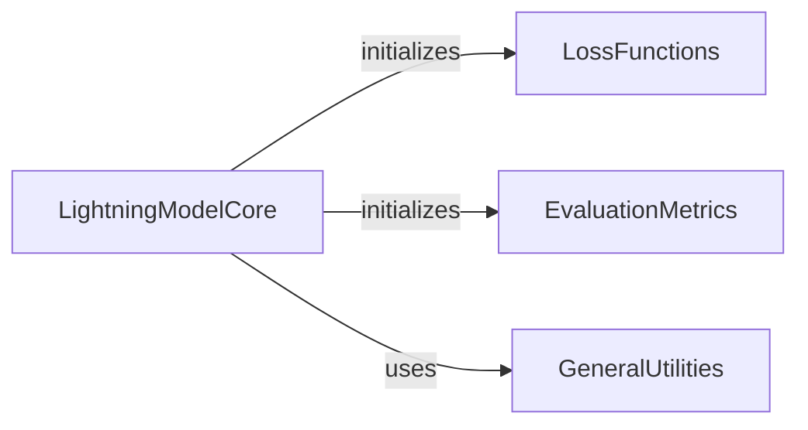

## Component Details

This component overview describes the 'Model Training & Prediction' subsystem, which leverages PyTorch Lightning to manage the entire lifecycle of deep learning models. The core functionality is encapsulated in the `LightningModelCore`, responsible for model initialization, training, and prediction. It interacts with `LossFunctions` to compute training errors, `EvaluationMetrics` to assess model performance, and `GeneralUtilities` for various data processing tasks. The primary flow involves the `LightningModelCore` initializing and utilizing these supporting components during the model's training, validation, testing, and prediction phases.

### LightningModelCore
This component encapsulates the core functionality of the gReLU deep learning model within the PyTorch Lightning framework. It handles model initialization, including building the neural network architecture, setting up loss functions, activation functions, and performance metrics. It also defines the forward pass for inference, the training step, and the prediction pipeline for datasets, including data loading and device parsing.

**Related Classes/Methods**:

- `grelu.lightning.LightningModel:__init__` (full file reference)
- `grelu.lightning.LightningModel:training_step` (full file reference)
- `grelu.lightning.LightningModel:predict_on_dataset` (full file reference)
- `grelu.lightning.LightningModel.build_model` (full file reference)
- `grelu.lightning.LightningModel.initialize_loss` (full file reference)
- `grelu.lightning.LightningModel.initialize_activation` (full file reference)
- `grelu.lightning.LightningModel.initialize_metrics` (full file reference)
- `grelu.lightning.LightningModel.reset_transform` (full file reference)
- `grelu.lightning.LightningModel:forward` (full file reference)
- `grelu.lightning.LightningModel.format_input` (full file reference)
- `grelu.lightning.LightningModel.make_predict_loader` (full file reference)
- `grelu.lightning.LightningModel.parse_devices` (full file reference)

### LossFunctions
This component provides various loss functions used by the LightningModelCore during training. It specifically includes the PoissonMultinomialLoss, which is initialized and utilized by the model to compute the discrepancy between predicted and actual values.

**Related Classes/Methods**:

- <a href="https://github.com/Genentech/gReLU/blob/master/src/grelu/lightning/losses.py#L16-L93" target="_blank" rel="noopener noreferrer">`grelu.lightning.losses.PoissonMultinomialLoss` (16:93)</a>

### EvaluationMetrics
This component defines and manages the performance metrics used to evaluate the LightningModelCore. It includes metrics such as Mean Squared Error (MSE), Pearson Correlation Coefficient, and Best F1 score, which are initialized and logged by the model to track training and prediction performance.

**Related Classes/Methods**:

- <a href="https://github.com/Genentech/gReLU/blob/master/src/grelu/lightning/metrics.py#L76-L119" target="_blank" rel="noopener noreferrer">`grelu.lightning.metrics.MSE` (76:119)</a>
- <a href="https://github.com/Genentech/gReLU/blob/master/src/grelu/lightning/metrics.py#L122-L161" target="_blank" rel="noopener noreferrer">`grelu.lightning.metrics.PearsonCorrCoef` (122:161)</a>
- <a href="https://github.com/Genentech/gReLU/blob/master/src/grelu/lightning/metrics.py#L18-L73" target="_blank" rel="noopener noreferrer">`grelu.lightning.metrics.BestF1` (18:73)</a>

### GeneralUtilities
This component offers a collection of general-purpose utility functions that support various operations within the gReLU subsystem. These utilities include functions for aggregating data (get_aggfunc) and ensuring data is in a list format (make_list), which are leveraged by the LightningModelCore for data processing and device handling.

**Related Classes/Methods**:

- <a href="https://github.com/Genentech/gReLU/blob/master/src/grelu/utils.py#L29-L60" target="_blank" rel="noopener noreferrer">`grelu.utils.get_aggfunc` (29:60)</a>
- <a href="https://github.com/Genentech/gReLU/blob/master/src/grelu/utils.py#L128-L154" target="_blank" rel="noopener noreferrer">`grelu.utils.make_list` (128:154)</a>

### [FAQ](https://github.com/CodeBoarding/GeneratedOnBoardings/tree/main?tab=readme-ov-file#faq)