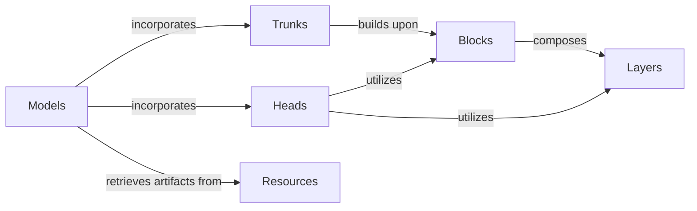

## Component Details

Defines fundamental neural network layers and reusable composite blocks for constructing deep learning models. This component is structured into basic 'Layers', composite 'Blocks', feature-extracting 'Trunks', output 'Heads', and complete 'Models', with 'Resources' managing external assets.

### Layers
Provides fundamental neural network operations such as normalization, activation, pooling, attention mechanisms, and channel transformations. These are the basic building blocks used by higher-level components.

**Related Classes/Methods**:

- <a href="https://github.com/Genentech/gReLU/blob/master/src/grelu/model/layers.py#L431-L447" target="_blank" rel="noopener noreferrer">`grelu.model.layers.Attention:forward` (431:447)</a>
- <a href="https://github.com/Genentech/gReLU/blob/master/src/grelu/model/layers.py#L162-L195" target="_blank" rel="noopener noreferrer">`grelu.model.layers.Norm:__init__` (162:195)</a>
- <a href="https://github.com/Genentech/gReLU/blob/master/src/grelu/model/layers.py#L245-L267" target="_blank" rel="noopener noreferrer">`grelu.model.layers.Dropout` (245:267)</a>
- <a href="https://github.com/Genentech/gReLU/blob/master/src/grelu/model/layers.py#L30-L48" target="_blank" rel="noopener noreferrer">`grelu.model.layers.Activation:__init__` (30:48)</a>
- <a href="https://github.com/Genentech/gReLU/blob/master/src/grelu/model/layers.py#L78-L98" target="_blank" rel="noopener noreferrer">`grelu.model.layers.Pool:__init__` (78:98)</a>
- <a href="https://github.com/Genentech/gReLU/blob/master/src/grelu/model/layers.py#L210-L242" target="_blank" rel="noopener noreferrer">`grelu.model.layers.ChannelTransform` (210:242)</a>
- <a href="https://github.com/Genentech/gReLU/blob/master/src/grelu/model/layers.py#L450-L515" target="_blank" rel="noopener noreferrer">`grelu.model.layers.FlashAttention` (450:515)</a>
- <a href="https://github.com/Genentech/gReLU/blob/master/src/grelu/model/layers.py#L270-L305" target="_blank" rel="noopener noreferrer">`grelu.model.layers.Crop` (270:305)</a>
- <a href="https://github.com/Genentech/gReLU/blob/master/src/grelu/model/layers.py#L113-L148" target="_blank" rel="noopener noreferrer">`grelu.model.layers.AdaptivePool` (113:148)</a>
- <a href="https://github.com/Genentech/gReLU/blob/master/src/grelu/model/position.py#L11-L47" target="_blank" rel="noopener noreferrer">`grelu.model.position.get_central_mask` (11:47)</a>

### Blocks
Composes various Layers to form reusable neural network blocks. These blocks encapsulate common patterns like linear layers, convolutional layers, feed-forward networks, and transformer components, serving as intermediate building units for constructing larger network architectures.

**Related Classes/Methods**:

- <a href="https://github.com/Genentech/gReLU/blob/master/src/grelu/model/blocks.py#L42-L60" target="_blank" rel="noopener noreferrer">`grelu.model.blocks.LinearBlock:__init__` (42:60)</a>
- <a href="https://github.com/Genentech/gReLU/blob/master/src/grelu/model/blocks.py#L113-L192" target="_blank" rel="noopener noreferrer">`grelu.model.blocks.ConvBlock:__init__` (113:192)</a>
- <a href="https://github.com/Genentech/gReLU/blob/master/src/grelu/model/blocks.py#L223-L318" target="_blank" rel="noopener noreferrer">`grelu.model.blocks.ChannelTransformBlock` (223:318)</a>
- <a href="https://github.com/Genentech/gReLU/blob/master/src/grelu/model/blocks.py#L321-L374" target="_blank" rel="noopener noreferrer">`grelu.model.blocks.Stem` (321:374)</a>
- <a href="https://github.com/Genentech/gReLU/blob/master/src/grelu/model/blocks.py#L559-L609" target="_blank" rel="noopener noreferrer">`grelu.model.blocks.FeedForwardBlock` (559:609)</a>
- <a href="https://github.com/Genentech/gReLU/blob/master/src/grelu/model/blocks.py#L612-L673" target="_blank" rel="noopener noreferrer">`grelu.model.blocks.GRUBlock` (612:673)</a>
- <a href="https://github.com/Genentech/gReLU/blob/master/src/grelu/model/blocks.py#L698-L757" target="_blank" rel="noopener noreferrer">`grelu.model.blocks.TransformerBlock:__init__` (698:757)</a>
- <a href="https://github.com/Genentech/gReLU/blob/master/src/grelu/model/blocks.py#L852-L916" target="_blank" rel="noopener noreferrer">`grelu.model.blocks.UnetBlock` (852:916)</a>
- <a href="https://github.com/Genentech/gReLU/blob/master/src/grelu/model/blocks.py#L426-L556" target="_blank" rel="noopener noreferrer">`grelu.model.blocks.ConvTower` (426:556)</a>
- <a href="https://github.com/Genentech/gReLU/blob/master/src/grelu/model/blocks.py#L780-L849" target="_blank" rel="noopener noreferrer">`grelu.model.blocks.TransformerTower` (780:849)</a>
- <a href="https://github.com/Genentech/gReLU/blob/master/src/grelu/model/blocks.py#L919-L951" target="_blank" rel="noopener noreferrer">`grelu.model.blocks.UnetTower` (919:951)</a>
- <a href="https://github.com/Genentech/gReLU/blob/master/src/grelu/model/blocks.py#L377-L423" target="_blank" rel="noopener noreferrer">`grelu.model.blocks.SeparableConv` (377:423)</a>

### Trunks
Represents the main feature extraction backbone of the neural network models. Trunks are typically composed of various Blocks and are responsible for processing the input data and generating high-level features before they are passed to the output heads.

**Related Classes/Methods**:

- <a href="https://github.com/Genentech/gReLU/blob/master/src/grelu/model/trunks/explainn.py#L7-L67" target="_blank" rel="noopener noreferrer">`grelu.model.trunks.explainn.ExplaiNNConvBlock` (7:67)</a>
- <a href="https://github.com/Genentech/gReLU/blob/master/src/grelu/model/trunks/explainn.py#L70-L143" target="_blank" rel="noopener noreferrer">`grelu.model.trunks.explainn.ExplaiNNTrunk` (70:143)</a>
- <a href="https://github.com/Genentech/gReLU/blob/master/src/grelu/model/trunks/borzoi.py#L12-L99" target="_blank" rel="noopener noreferrer">`grelu.model.trunks.borzoi.BorzoiConvTower` (12:99)</a>
- <a href="https://github.com/Genentech/gReLU/blob/master/src/grelu/model/trunks/borzoi.py#L102-L223" target="_blank" rel="noopener noreferrer">`grelu.model.trunks.borzoi.BorzoiTrunk` (102:223)</a>
- <a href="https://github.com/Genentech/gReLU/blob/master/src/grelu/model/trunks/enformer.py#L14-L101" target="_blank" rel="noopener noreferrer">`grelu.model.trunks.enformer.EnformerConvTower` (14:101)</a>
- <a href="https://github.com/Genentech/gReLU/blob/master/src/grelu/model/trunks/enformer.py#L104-L172" target="_blank" rel="noopener noreferrer">`grelu.model.trunks.enformer.EnformerTransformerBlock` (104:172)</a>
- <a href="https://github.com/Genentech/gReLU/blob/master/src/grelu/model/trunks/enformer.py#L175-L236" target="_blank" rel="noopener noreferrer">`grelu.model.trunks.enformer.EnformerTransformerTower` (175:236)</a>
- <a href="https://github.com/Genentech/gReLU/blob/master/src/grelu/model/trunks/enformer.py#L239-L308" target="_blank" rel="noopener noreferrer">`grelu.model.trunks.enformer.EnformerTrunk` (239:308)</a>
- `grelu.model.trunks.ConvTrunk` (full file reference)
- `grelu.model.trunks.DilatedConvTrunk` (full file reference)
- `grelu.model.trunks.ConvGRUTrunk` (full file reference)
- `grelu.model.trunks.ConvTransformerTrunk` (full file reference)

### Heads
Defines the output layers of the neural network models. Heads take the features extracted by the Trunks and transform them into the final predictions or outputs of the model.

**Related Classes/Methods**:

- <a href="https://github.com/Genentech/gReLU/blob/master/src/grelu/model/heads.py#L19-L70" target="_blank" rel="noopener noreferrer">`grelu.model.heads.ConvHead` (19:70)</a>
- <a href="https://github.com/Genentech/gReLU/blob/master/src/grelu/model/heads.py#L73-L156" target="_blank" rel="noopener noreferrer">`grelu.model.heads.MLPHead` (73:156)</a>

### Models
Encapsulates complete neural network architectures by combining Trunks and Heads. These classes represent the top-level definitions of various gReLU models, handling the overall forward pass and potentially loading pretrained weights.

**Related Classes/Methods**:

- <a href="https://github.com/Genentech/gReLU/blob/master/src/grelu/model/models.py#L59-L143" target="_blank" rel="noopener noreferrer">`grelu.model.models.ConvModel` (59:143)</a>
- <a href="https://github.com/Genentech/gReLU/blob/master/src/grelu/model/models.py#L146-L201" target="_blank" rel="noopener noreferrer">`grelu.model.models.DilatedConvModel` (146:201)</a>
- <a href="https://github.com/Genentech/gReLU/blob/master/src/grelu/model/models.py#L204-L288" target="_blank" rel="noopener noreferrer">`grelu.model.models.ConvGRUModel` (204:288)</a>
- <a href="https://github.com/Genentech/gReLU/blob/master/src/grelu/model/models.py#L291-L390" target="_blank" rel="noopener noreferrer">`grelu.model.models.ConvTransformerModel` (291:390)</a>
- <a href="https://github.com/Genentech/gReLU/blob/master/src/grelu/model/models.py#L393-L472" target="_blank" rel="noopener noreferrer">`grelu.model.models.ConvMLPModel` (393:472)</a>
- <a href="https://github.com/Genentech/gReLU/blob/master/src/grelu/model/models.py#L475-L559" target="_blank" rel="noopener noreferrer">`grelu.model.models.BorzoiModel` (475:559)</a>
- <a href="https://github.com/Genentech/gReLU/blob/master/src/grelu/model/models.py#L562-L626" target="_blank" rel="noopener noreferrer">`grelu.model.models.BorzoiPretrainedModel` (562:626)</a>
- <a href="https://github.com/Genentech/gReLU/blob/master/src/grelu/model/models.py#L629-L662" target="_blank" rel="noopener noreferrer">`grelu.model.models.ExplaiNNModel` (629:662)</a>
- <a href="https://github.com/Genentech/gReLU/blob/master/src/grelu/model/models.py#L665-L732" target="_blank" rel="noopener noreferrer">`grelu.model.models.EnformerModel` (665:732)</a>
- <a href="https://github.com/Genentech/gReLU/blob/master/src/grelu/model/models.py#L735-L790" target="_blank" rel="noopener noreferrer">`grelu.model.models.EnformerPretrainedModel` (735:790)</a>
- <a href="https://github.com/Genentech/gReLU/blob/master/src/grelu/model/models.py#L38-L42" target="_blank" rel="noopener noreferrer">`grelu.model.models.BaseModel.__init__` (38:42)</a>

### Resources
Manages external resources, such as retrieving pre-trained model artifacts.

**Related Classes/Methods**:

- `grelu.resources.get_artifact` (full file reference)

### [FAQ](https://github.com/CodeBoarding/GeneratedOnBoardings/tree/main?tab=readme-ov-file#faq)