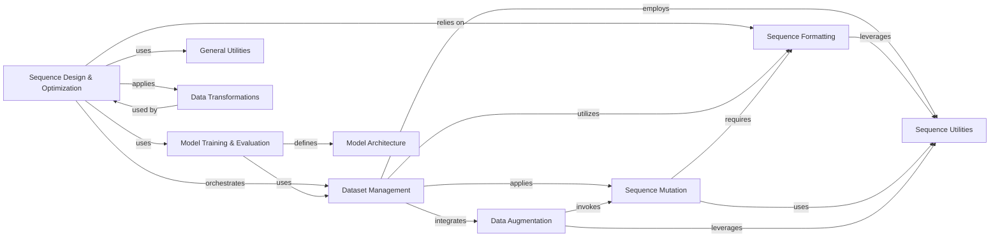

## Component Details

The `grelu` system focuses on the design and analysis of biological sequences, particularly DNA. Its core purpose is to enable the directed evolution and optimization of novel sequences using deep learning models. This involves a workflow where sequences are formatted, processed into datasets, fed into trained models for prediction, and then iteratively mutated and evaluated to achieve desired properties. The system integrates various utility components for sequence manipulation, data augmentation, and result interpretation, all underpinned by robust model architectures and training pipelines.

### Sequence Design & Optimization
Implements algorithms and workflows for the directed design and optimization of novel biological sequences, leveraging trained deep learning models.

**Related Classes/Methods**:

- <a href="https://github.com/Genentech/gReLU/blob/master/src/grelu/design.py#L19-L215" target="_blank" rel="noopener noreferrer">`grelu.design.evolve` (19:215)</a>
- <a href="https://github.com/Genentech/gReLU/blob/master/src/grelu/design.py#L219-L292" target="_blank" rel="noopener noreferrer">`grelu.design.ledidi` (219:292)</a>

### Model Training & Evaluation
Encapsulates the functionalities for training, validating, and evaluating deep learning models using PyTorch Lightning.

**Related Classes/Methods**:

- `grelu.lightning.LightningModel` (full file reference)

### Dataset Management
Responsible for creating and managing different types of sequence datasets, facilitating data loading and access for model training and inference.

**Related Classes/Methods**:

- <a href="https://github.com/Genentech/gReLU/blob/master/src/grelu/data/dataset.py#L452-L530" target="_blank" rel="noopener noreferrer">`grelu.data.dataset.SeqDataset` (452:530)</a>
- <a href="https://github.com/Genentech/gReLU/blob/master/src/grelu/data/dataset.py#L869-L938" target="_blank" rel="noopener noreferrer">`grelu.data.dataset.ISMDataset` (869:938)</a>
- <a href="https://github.com/Genentech/gReLU/blob/master/src/grelu/data/dataset.py#L941-L1000" target="_blank" rel="noopener noreferrer">`grelu.data.dataset.MotifScanDataset` (941:1000)</a>

### Sequence Formatting
This component is responsible for validating and converting DNA sequences between various accepted formats.

**Related Classes/Methods**:

- <a href="https://github.com/Genentech/gReLU/blob/master/src/grelu/sequence/format.py#L375-L440" target="_blank" rel="noopener noreferrer">`grelu.sequence.format.convert_input_type` (375:440)</a>

### General Utilities
This component provides miscellaneous utility functions that are broadly applicable across different parts of the `grelu` system.

**Related Classes/Methods**:

- <a href="https://github.com/Genentech/gReLU/blob/master/src/grelu/utils.py#L128-L154" target="_blank" rel="noopener noreferrer">`grelu.utils.make_list` (128:154)</a>

### Sequence Mutation
This component provides functionalities for introducing mutations into DNA sequences, crucial for sequence design and augmentation processes.

**Related Classes/Methods**:

- <a href="https://github.com/Genentech/gReLU/blob/master/src/grelu/sequence/mutate.py#L12-L57" target="_blank" rel="noopener noreferrer">`grelu.sequence.mutate.mutate` (12:57)</a>
- <a href="https://github.com/Genentech/gReLU/blob/master/src/grelu/sequence/mutate.py#L170-L224" target="_blank" rel="noopener noreferrer">`grelu.sequence.mutate.random_mutate` (170:224)</a>

### Model Architecture
This component defines and implements the deep learning model architectures used for sequence analysis.

**Related Classes/Methods**:

- `grelu.model.models` (full file reference)

### Data Augmentation
This component implements various data augmentation techniques for DNA sequences to expand and diversify training datasets.

**Related Classes/Methods**:

- <a href="https://github.com/Genentech/gReLU/blob/master/src/grelu/data/augment.py#L95-L245" target="_blank" rel="noopener noreferrer">`grelu.data.augment.Augmenter` (95:245)</a>
- <a href="https://github.com/Genentech/gReLU/blob/master/src/grelu/data/augment.py#L65-L77" target="_blank" rel="noopener noreferrer">`grelu.data.augment.rc_seq` (65:77)</a>
- <a href="https://github.com/Genentech/gReLU/blob/master/src/grelu/data/augment.py#L50-L62" target="_blank" rel="noopener noreferrer">`grelu.data.augment.shift` (50:62)</a>

### Sequence Utilities
This component offers fundamental utility functions for manipulating DNA sequences, including operations like getting sequence lengths, padding, and trimming.

**Related Classes/Methods**:

- <a href="https://github.com/Genentech/gReLU/blob/master/src/grelu/sequence/utils.py#L24-L66" target="_blank" rel="noopener noreferrer">`grelu.sequence.utils.get_lengths` (24:66)</a>
- <a href="https://github.com/Genentech/gReLU/blob/master/src/grelu/sequence/utils.py#L106-L189" target="_blank" rel="noopener noreferrer">`grelu.sequence.utils.pad` (106:189)</a>
- <a href="https://github.com/Genentech/gReLU/blob/master/src/grelu/sequence/utils.py#L192-L260" target="_blank" rel="noopener noreferrer">`grelu.sequence.utils.trim` (192:260)</a>

### Data Transformations
This component provides various transformation functions for labels, predictions, and sequences, used for data processing and model output interpretation.

**Related Classes/Methods**:

- `grelu.transforms.prediction_transforms` (full file reference)
- `grelu.transforms.seq_transforms` (full file reference)

### [FAQ](https://github.com/CodeBoarding/GeneratedOnBoardings/tree/main?tab=readme-ov-file#faq)