```mermaid
graph LR
    Data_Management_Preparation["Data Management & Preparation"]
    Neural_Network_Building_Blocks["Neural Network Building Blocks"]
    Model_Architectures["Model Architectures"]
    Model_Training_Prediction["Model Training & Prediction"]
    Model_Analysis_Visualization["Model Analysis & Visualization"]
    Sequence_Design_Optimization["Sequence Design & Optimization"]
    Core_Resource_Utilities["Core & Resource Utilities"]
    Data_Management_Preparation -- "provides data to" --> Model_Training_Prediction
    Data_Management_Preparation -- "provides data to" --> Model_Analysis_Visualization
    Neural_Network_Building_Blocks -- "composes" --> Model_Architectures
    Model_Architectures -- "uses" --> Neural_Network_Building_Blocks
    Model_Architectures -- "provides models to" --> Model_Training_Prediction
    Model_Training_Prediction -- "consumes data from" --> Data_Management_Preparation
    Model_Training_Prediction -- "utilizes" --> Model_Architectures
    Model_Training_Prediction -- "generates outputs for" --> Model_Analysis_Visualization
    Model_Analysis_Visualization -- "interprets outputs from" --> Model_Training_Prediction
    Model_Analysis_Visualization -- "processes data from" --> Data_Management_Preparation
    Sequence_Design_Optimization -- "leverages" --> Model_Training_Prediction
    Sequence_Design_Optimization -- "operates on" --> Data_Management_Preparation
    Core_Resource_Utilities -- "supports" --> Data_Management_Preparation
    Core_Resource_Utilities -- "manages resources for" --> Model_Architectures
    Core_Resource_Utilities -- "provides utilities to" --> Model_Training_Prediction
    Core_Resource_Utilities -- "assists" --> Model_Analysis_Visualization
    Core_Resource_Utilities -- "aids" --> Sequence_Design_Optimization
    click Data_Management_Preparation href "https://github.com/CodeBoarding/GeneratedOnBoardings/blob/main/gReLU/Data Management & Preparation.md" "Details"
    click Neural_Network_Building_Blocks href "https://github.com/CodeBoarding/GeneratedOnBoardings/blob/main/gReLU/Neural Network Building Blocks.md" "Details"
    click Model_Architectures href "https://github.com/CodeBoarding/GeneratedOnBoardings/blob/main/gReLU/Model Architectures.md" "Details"
    click Model_Training_Prediction href "https://github.com/CodeBoarding/GeneratedOnBoardings/blob/main/gReLU/Model Training & Prediction.md" "Details"
    click Model_Analysis_Visualization href "https://github.com/CodeBoarding/GeneratedOnBoardings/blob/main/gReLU/Model Analysis & Visualization.md" "Details"
    click Sequence_Design_Optimization href "https://github.com/CodeBoarding/GeneratedOnBoardings/blob/main/gReLU/Sequence Design & Optimization.md" "Details"
    click Core_Resource_Utilities href "https://github.com/CodeBoarding/GeneratedOnBoardings/blob/main/gReLU/Core & Resource Utilities.md" "Details"
```

## Component Details

The `gReLU` project provides a comprehensive framework for deep learning analysis of biological sequences. It encompasses modules for efficient data management and preparation, robust neural network construction, streamlined model training and prediction, and advanced interpretation and visualization of model outputs. Additionally, it supports sequence design and leverages core utilities for various common tasks and external resource management.

### Data Management & Preparation
Manages all aspects of biological sequence data, including reading, basic manipulation, augmentation, variant processing, and providing abstract dataset interfaces for model consumption.

**Related Classes/Methods**:

- <a href="https://github.com/Genentech/gReLU/blob/master/src/grelu/sequence/mutate.py#L12-L57" target="_blank" rel="noopener noreferrer">`gReLU.src.grelu.sequence.mutate:mutate` (12:57)</a>
- <a href="https://github.com/Genentech/gReLU/blob/master/src/grelu/io/fasta.py#L29-L50" target="_blank" rel="noopener noreferrer">`gReLU.src.grelu.io.fasta:read_fasta` (29:50)</a>
- <a href="https://github.com/Genentech/gReLU/blob/master/src/grelu/data/augment.py#L188-L245" target="_blank" rel="noopener noreferrer">`gReLU.src.grelu.data.augment.Augmenter:__call__` (188:245)</a>
- <a href="https://github.com/Genentech/gReLU/blob/master/src/grelu/variant.py#L104-L139" target="_blank" rel="noopener noreferrer">`gReLU.src.grelu.variant:variant_to_seqs` (104:139)</a>
- <a href="https://github.com/Genentech/gReLU/blob/master/src/grelu/sequence/metrics.py#L14-L62" target="_blank" rel="noopener noreferrer">`gReLU.src.grelu.sequence.metrics:gc` (14:62)</a>
- <a href="https://github.com/Genentech/gReLU/blob/master/src/grelu/sequence/format.py#L113-L157" target="_blank" rel="noopener noreferrer">`gReLU.src.grelu.sequence.format:get_input_type` (113:157)</a>
- <a href="https://github.com/Genentech/gReLU/blob/master/src/grelu/sequence/utils.py#L24-L66" target="_blank" rel="noopener noreferrer">`gReLU.src.grelu.sequence.utils:get_lengths` (24:66)</a>
- <a href="https://github.com/Genentech/gReLU/blob/master/src/grelu/io/genome.py#L13-L33" target="_blank" rel="noopener noreferrer">`gReLU.src.grelu.io.genome:read_sizes` (13:33)</a>
- <a href="https://github.com/Genentech/gReLU/blob/master/src/grelu/io/bigwig.py#L31-L99" target="_blank" rel="noopener noreferrer">`gReLU.src.grelu.io.bigwig:read_bigwig` (31:99)</a>
- <a href="https://github.com/Genentech/gReLU/blob/master/src/grelu/data/preprocess.py#L73-L142" target="_blank" rel="noopener noreferrer">`gReLU.src.grelu.data.preprocess:filter_coverage` (73:142)</a>
- <a href="https://github.com/Genentech/gReLU/blob/master/src/grelu/data/dataset.py#L72-L156" target="_blank" rel="noopener noreferrer">`gReLU.src.grelu.data.dataset.LabeledSeqDataset:__init__` (72:156)</a>
- <a href="https://github.com/Genentech/gReLU/blob/master/src/grelu/data/dataset.py#L252-L300" target="_blank" rel="noopener noreferrer">`gReLU.src.grelu.data.dataset.DFSeqDataset:__init__` (252:300)</a>
- <a href="https://github.com/Genentech/gReLU/blob/master/src/grelu/data/dataset.py#L548-L582" target="_blank" rel="noopener noreferrer">`gReLU.src.grelu.data.dataset.VariantDataset:__init__` (548:582)</a>
- <a href="https://github.com/Genentech/gReLU/blob/master/src/grelu/data/dataset.py#L883-L904" target="_blank" rel="noopener noreferrer">`gReLU.src.grelu.data.dataset.ISMDataset:__init__` (883:904)</a>
- <a href="https://github.com/Genentech/gReLU/blob/master/src/grelu/data/dataset.py#L955-L983" target="_blank" rel="noopener noreferrer">`gReLU.src.grelu.data.dataset.MotifScanDataset:__init__` (955:983)</a>

### Neural Network Building Blocks
Defines fundamental neural network layers and reusable composite blocks for constructing deep learning models.

**Related Classes/Methods**:

- <a href="https://github.com/Genentech/gReLU/blob/master/src/grelu/model/layers.py#L431-L447" target="_blank" rel="noopener noreferrer">`gReLU.src.grelu.model.layers.Attention:forward` (431:447)</a>
- <a href="https://github.com/Genentech/gReLU/blob/master/src/grelu/model/blocks.py#L113-L192" target="_blank" rel="noopener noreferrer">`gReLU.src.grelu.model.blocks.ConvBlock:__init__` (113:192)</a>
- <a href="https://github.com/Genentech/gReLU/blob/master/src/grelu/model/layers.py#L30-L48" target="_blank" rel="noopener noreferrer">`gReLU.src.grelu.model.layers.Activation:__init__` (30:48)</a>
- <a href="https://github.com/Genentech/gReLU/blob/master/src/grelu/model/layers.py#L78-L98" target="_blank" rel="noopener noreferrer">`gReLU.src.grelu.model.layers.Pool:__init__` (78:98)</a>
- <a href="https://github.com/Genentech/gReLU/blob/master/src/grelu/model/layers.py#L162-L195" target="_blank" rel="noopener noreferrer">`gReLU.src.grelu.model.layers.Norm:__init__` (162:195)</a>
- <a href="https://github.com/Genentech/gReLU/blob/master/src/grelu/model/blocks.py#L42-L60" target="_blank" rel="noopener noreferrer">`gReLU.src.grelu.model.blocks.LinearBlock:__init__` (42:60)</a>
- <a href="https://github.com/Genentech/gReLU/blob/master/src/grelu/model/blocks.py#L698-L757" target="_blank" rel="noopener noreferrer">`gReLU.src.grelu.model.blocks.TransformerBlock:__init__` (698:757)</a>

### Model Architectures
Encapsulates complete deep learning model architectures, combining various feature extraction backbones (trunks) and output layers (heads) to form functional models.

**Related Classes/Methods**:

- <a href="https://github.com/Genentech/gReLU/blob/master/src/grelu/model/trunks/borzoi.py#L129-L205" target="_blank" rel="noopener noreferrer">`gReLU.src.grelu.model.trunks.borzoi.BorzoiTrunk:__init__` (129:205)</a>
- <a href="https://github.com/Genentech/gReLU/blob/master/src/grelu/model/heads.py#L34-L61" target="_blank" rel="noopener noreferrer">`gReLU.src.grelu.model.heads.ConvHead:__init__` (34:61)</a>
- <a href="https://github.com/Genentech/gReLU/blob/master/src/grelu/model/models.py#L87-L143" target="_blank" rel="noopener noreferrer">`gReLU.src.grelu.model.models.ConvModel:__init__` (87:143)</a>
- `gReLU.src.grelu.model.trunks.ConvTrunk:__init__` (full file reference)
- <a href="https://github.com/Genentech/gReLU/blob/master/src/grelu/model/trunks/enformer.py#L258-L300" target="_blank" rel="noopener noreferrer">`gReLU.src.grelu.model.trunks.enformer.EnformerTrunk:__init__` (258:300)</a>
- <a href="https://github.com/Genentech/gReLU/blob/master/src/grelu/model/models.py#L503-L559" target="_blank" rel="noopener noreferrer">`gReLU.src.grelu.model.models.BorzoiModel:__init__` (503:559)</a>

### Model Training & Prediction
Provides the PyTorch Lightning interface for managing the entire lifecycle of deep learning models, including training, validation, testing, and prediction workflows.

**Related Classes/Methods**:

- `gReLU.src.grelu.lightning.LightningModel:__init__` (full file reference)
- `gReLU.src.grelu.lightning.LightningModel:training_step` (full file reference)
- `gReLU.src.grelu.lightning.LightningModel:predict_on_dataset` (full file reference)

### Model Analysis & Visualization
Offers a comprehensive suite of tools for interpreting model behavior, analyzing sequence features (e.g., attribution, motifs, MoDISco, pattern simulation), and generating various plots and visual representations of data and results.

**Related Classes/Methods**:

- <a href="https://github.com/Genentech/gReLU/blob/master/src/grelu/interpret/modisco.py#L188-L339" target="_blank" rel="noopener noreferrer">`gReLU.src.grelu.interpret.modisco:run_modisco` (188:339)</a>
- <a href="https://github.com/Genentech/gReLU/blob/master/src/grelu/interpret/motifs.py#L113-L214" target="_blank" rel="noopener noreferrer">`gReLU.src.grelu.interpret.motifs:scan_sequences` (113:214)</a>
- <a href="https://github.com/Genentech/gReLU/blob/master/src/grelu/interpret/score.py#L23-L122" target="_blank" rel="noopener noreferrer">`gReLU.src.grelu.interpret.score:ISM_predict` (23:122)</a>
- <a href="https://github.com/Genentech/gReLU/blob/master/src/grelu/interpret/simulate.py#L9-L87" target="_blank" rel="noopener noreferrer">`gReLU.src.grelu.interpret.simulate:marginalize_patterns` (9:87)</a>
- <a href="https://github.com/Genentech/gReLU/blob/master/src/grelu/interpret/score.py#L125-L229" target="_blank" rel="noopener noreferrer">`gReLU.src.grelu.interpret.score:get_attributions` (125:229)</a>
- <a href="https://github.com/Genentech/gReLU/blob/master/src/grelu/interpret/motifs.py#L369-L411" target="_blank" rel="noopener noreferrer">`gReLU.src.grelu.interpret.motifs:run_tomtom` (369:411)</a>
- <a href="https://github.com/Genentech/gReLU/blob/master/src/grelu/visualize.py#L446-L517" target="_blank" rel="noopener noreferrer">`gReLU.src.grelu.visualize:plot_attributions` (446:517)</a>
- <a href="https://github.com/Genentech/gReLU/blob/master/src/grelu/visualize.py#L520-L583" target="_blank" rel="noopener noreferrer">`gReLU.src.grelu.visualize:plot_ISM` (520:583)</a>
- <a href="https://github.com/Genentech/gReLU/blob/master/src/grelu/visualize.py#L123-L157" target="_blank" rel="noopener noreferrer">`gReLU.src.grelu.visualize:plot_pred_distribution` (123:157)</a>
- <a href="https://github.com/Genentech/gReLU/blob/master/src/grelu/visualize.py#L586-L700" target="_blank" rel="noopener noreferrer">`gReLU.src.grelu.visualize:plot_tracks` (586:700)</a>

### Sequence Design & Optimization
Implements algorithms and workflows for the directed design and optimization of novel biological sequences, leveraging trained deep learning models.

**Related Classes/Methods**:

- <a href="https://github.com/Genentech/gReLU/blob/master/src/grelu/design.py#L19-L215" target="_blank" rel="noopener noreferrer">`gReLU.src.grelu.design:evolve` (19:215)</a>
- <a href="https://github.com/Genentech/gReLU/blob/master/src/grelu/design.py#L219-L292" target="_blank" rel="noopener noreferrer">`gReLU.src.grelu.design:ledidi` (219:292)</a>

### Core & Resource Utilities
Provides general-purpose helper functions, specialized data/prediction transformation utilities, and manages access to external resources like pre-trained models and datasets.

**Related Classes/Methods**:

- `gReLU.src.grelu.resources:get_artifact` (full file reference)
- `gReLU.src.grelu.resources:load_model` (full file reference)
- <a href="https://github.com/Genentech/gReLU/blob/master/src/grelu/utils.py#L63-L93" target="_blank" rel="noopener noreferrer">`gReLU.src.grelu.utils:get_compare_func` (63:93)</a>
- <a href="https://github.com/Genentech/gReLU/blob/master/src/grelu/transforms/prediction_transforms.py#L39-L92" target="_blank" rel="noopener noreferrer">`gReLU.src.grelu.transforms.prediction_transforms.Aggregate:__init__` (39:92)</a>
- <a href="https://github.com/Genentech/gReLU/blob/master/src/grelu/utils.py#L128-L154" target="_blank" rel="noopener noreferrer">`gReLU.src.grelu.utils:make_list` (128:154)</a>
- <a href="https://github.com/Genentech/gReLU/blob/master/src/grelu/transforms/label_transforms.py#L25-L33" target="_blank" rel="noopener noreferrer">`gReLU.src.grelu.transforms.label_transforms.LabelTransform:__init__` (25:33)</a>
- <a href="https://github.com/Genentech/gReLU/blob/master/src/grelu/transforms/seq_transforms.py#L54-L55" target="_blank" rel="noopener noreferrer">`gReLU.src.grelu.transforms.seq_transforms.PatternScore:__call__` (54:55)</a>

### [FAQ](https://github.com/CodeBoarding/GeneratedOnBoardings/tree/main?tab=readme-ov-file#faq)