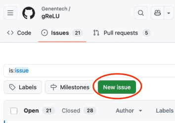
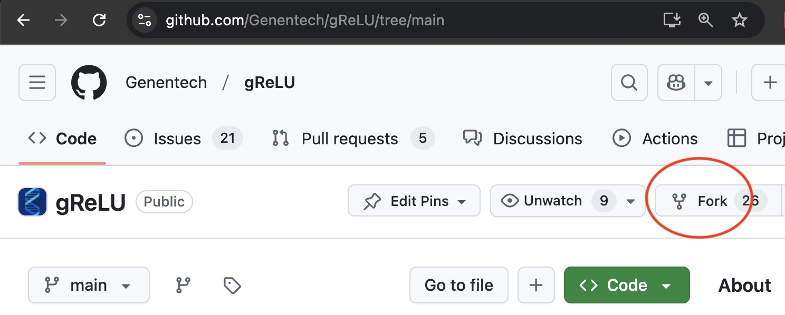

# Contributing

Welcome to the ``gReLU`` contributor's guide.

This document focuses on getting any potential contributor familiarized with the development processes, but [other kinds of contributions](https://opensource.guide/how-to-contribute) are also appreciated.

If you are new to using git or have never collaborated in a project previously, please have a look at
[contribution-guide.org](https://www.contribution-guide.org/). Other resources are also listed in the
excellent [guide created by FreeCodeCamp](https://github.com/FreeCodeCamp/how-to-contribute).

Please notice, all users and contributors are expected to be **open, considerate, reasonable, and
respectful**. When in doubt, [Python Software Foundation's Code of Conduct](https://www.python.org/psf/conduct/) is a good reference in terms of behavior guidelines.

## Issue Reports

If you experience bugs or general issues with ``gReLU``, please have a look at the
[issue tracker](https://github.com/Genentech/gReLU/issues). If you don't see anything useful there, please file a new issue report.

(Don't forget to include the closed issues in your search. Sometimes a solution was already reported, and the problem is considered solved.)

You can file a new issue by clicking the "New issue" button at the top right of the issue tracker.


Your new issue report should include the following information:

1. Information about your programming environment (e.g., operating system, Python version)
2. Steps to reproduce the problem. Please try to simplify the reproduction steps to a very minimal example that still illustrates the problem you are facing. By removing other factors, you help us to identify the root cause of the issue.
4. The full error message that you encountered, if any.
5. Any steps that you took to diagnose or fix the issue, and their outcomes.
6. Any suggestions for resolving the issue.


## Making code contributions

### Coding resources

``gReLU`` uses pytorch and pytorch-lightning. The below tutorials are good starting points to become familiar with these frameworks:

[PyTorch tutorials](https://pytorch.org/tutorials/beginner/basics/intro.html)

[Lightning tutorials](https://lightning.ai/docs/pytorch/stable/levels/core_skills.html)

### Understanding project structure

We welcome external contributions to ``gReLU``. Before planning changes to the code, we suggest carefully examining the current structure and organization of the package.

The [API reference](https://genentech.github.io/gReLU/autoapi/index.html) lists all the modules and submodules available in gReLU. Clicking on individual modules on this list will reveal a description of the module and what kinds of functions it is meant to contain. The descriptions also contain more detailed explanations of the expected structure of each module. This will help you find the appropriate location to make changes.

For instance, the table below lists some different types of functionality that contributors may want to add or change, and the corresponding module / submodule of ``gReLU``. Click on the name of a module for more details on its structure.

| Functionality    | Module |
| ---------------- | ------- |
| Functions to read / write genomic data  | [`grelu.io`](https://genentech.github.io/gReLU/autoapi/grelu/io/index.html) |
| Functions to preprocess genomic data after it is loaded | [`grelu.data.preprocess`](https://genentech.github.io/gReLU/autoapi/grelu/data/preprocess/index.html) |
| New data augmentation methods    | [`grelu.data.augment`](https://genentech.github.io/gReLU/autoapi/grelu/data/augment/index.html) |
| Functions to introduce various types of in silico mutations into DNA sequences | [`grelu.sequence.mutate`](https://genentech.github.io/gReLU/autoapi/grelu/sequence/mutate/index.html) |
| Other functions to manipulate DNA sequences | [`grelu.sequence.utils`](https://genentech.github.io/gReLU/autoapi/grelu/sequence/utils/index.html) |
| Functions to score DNA sequences based on their content | [`grelu.transforms.seq_transforms`](https://genentech.github.io/gReLU/autoapi/grelu/transforms/seq_transforms/index.html) |
| Functions to transform model predictions | [`grelu.transforms.prediction_transforms`](https://genentech.github.io/gReLU/autoapi/grelu/transforms/prediction_transforms/index.html) |
| New types of model layers | [`grelu.model.layers`](https://genentech.github.io/gReLU/autoapi/grelu/model/layers/index.html) |
| New model architectures | [`grelu.model.models`](https://genentech.github.io/gReLU/autoapi/grelu/model/models/index.html) |
| New loss functions | [`grelu.lightning.losses`](https://genentech.github.io/gReLU/autoapi/grelu/lightning/losses/index.html)|
| New metrics to calculate model performance | [`grelu.lightning.metrics`](https://genentech.github.io/gReLU/autoapi/grelu/lightning/metrics/index.html) |
| New plots and visualizations | [`grelu.visualize`](https://genentech.github.io/gReLU/autoapi/grelu/visualize/index.html) |
| Unit tests for new functions | [`tests`](https://github.com/Genentech/gReLU/tree/main/tests) |

Two ex


For complex changes that may not fit clearly within the established package structure, it is important to first raise an issue (see instructions below).


## Step-by-step instructions to contribute new code

### Submit an issue

Before you work on any non-trivial code contribution it's best to first create an issue in the
[issue tracker](https://github.com/Genentech/gReLU/issues) to start a discussion on the subject.
This often provides additional considerations and avoids unnecessary work.

### Create an environment

Before you start coding, we recommend creating an isolated [virtual
environment](https://realpython.com/python-virtual-environments-a-primer/) to avoid any problems with your installed Python packages. This can easily be done via either [virtualenv](https://virtualenv.pypa.io/en/stable/):
```
    virtualenv <PATH TO VENV>
    source <PATH TO VENV>/bin/activate
```
or [Miniconda](https://docs.conda.io/en/latest/miniconda.html):
```
    conda create -n grelu python=3 six virtualenv pytest pytest-cov
    conda activate grelu
```
### Clone the repository

1. Create an user account on [GitHub](https://github.com), if you do not already have one.
2. Fork the [project repository](https://github.com/Genentech/gReLU/): click on the *Fork* button near the top of
   the page. This creates a copy of the code under your account on [GitHub](https://github.com/).

   

4. Clone this copy to your local disk::
```
    git clone git@github.com:YourLogin/grelu.git
    cd grelu
```
4. You should run::
```
    pip install -U pip setuptools -e .
```
   to be able to import the package under development in the Python REPL.

5. Install [pre-commit](https://pre-commit.com/):
```
    pip install pre-commit
    pre-commit install
```
   ``grelu`` comes with a lot of hooks configured to automatically help the
   developer to check the code being written.

### Implement your changes

1. Create a branch to hold your changes::
```
    git checkout -b my-feature
```
   and start making changes. Never work on the main branch!

2. Implement your code changes on this branch.

3. If you change or add any functions, modules and classes, don't forget to update or add docstrings to describe these changes.

4. If your contribution adds an additional feature and is not just a bugfix, we suggest also adding unit tests in https://github.com/Genentech/gReLU/tree/main/tests.

5. Add yourself to the list of contributors in ``AUTHORS.rst``.

6. When you’re done editing, do::
```p
    git add <MODIFIED FILES>
    git commit
```
   to record your changes in git. Moreover, writing a [descriptive commit message](https://chris.beams.io/posts/git-commit)
   is highly recommended.

   Please make sure to see the validation messages from [pre-commit](https://pre-commit.com/) and fix any issues.
   This should automatically use [flake8](https://flake8.pycqa.org/en/stable/)/[black](https://pypi.org/project/black/)
   to check/fix the code style in a way that is compatible with the project.

### Test your changes

Please check that your changes don't break any unit tests with::
```
    tox
```
   (after having installed [tox](https://tox.wiki/en/stable/) with ``pip install tox`` or ``pipx``).
   You can also use [tox](https://tox.wiki/en/stable/) to run several other pre-configured tasks in the
   repository. Try ``tox -av`` to see a list of the available checks.

### Submit your contribution

1. If everything works fine, push your local branch to [GitHub](https://github.com/) with:
```
    git push -u origin my-feature
```
2. Go to the web page of your fork and click "Create pull request"
   to send your changes for review.

   Find more detailed information in [creating a PR](https://docs.github.com/en/pull-requests/collaborating-with-pull-requests/proposing-changes-to-your-work-with-pull-requests/creating-a-pull-request). You might also want to open the PR as a draft first and mark it as ready for review
   after the feedback from the continuous integration (CI) system or any required fixes.

## Troubleshooting

The following tips can be used when facing problems to build or test the
package:

1. Make sure to fetch all the tags from the upstream repository_.
   The command ``git describe --abbrev=0 --tags`` should return the version you
   are expecting. If you are trying to run CI scripts in a fork repository,
   make sure to push all the tags.
   You can also try to remove all the egg files or the complete egg folder, i.e.,
   ``.eggs``, as well as the ``*.egg-info`` folders in the ``src`` folder or
   potentially in the root of your project.

2. Sometimes [tox](https://tox.wiki/en/stable/) misses out when new dependencies are added, especially to
   ``setup.cfg`` and ``docs/requirements.txt``. If you find any problems with
   missing dependencies when running a command with [tox](https://tox.wiki/en/stable/), try to recreate the
   ``tox`` environment using the ``-r`` flag. For example, instead of::
```shell
    tox -e docs
```
   Try running::
```shell
    tox -r -e docs
```
3. Make sure to have a reliable [tox](https://tox.wiki/en/stable/) installation that uses the correct
   Python version (e.g., 3.7+). When in doubt you can run::

```shell
    tox --version
    # OR
    which tox
```

   If you have trouble and are seeing weird errors upon running [tox](https://tox.wiki/en/stable/), you can
   also try to create a dedicated [virtual environment](https://realpython.com/python-virtual-environments-a-primer/)
   with a [tox](https://tox.wiki/en/stable/) binary freshly installed. For example::

    virtualenv .venv
    source .venv/bin/activate
    .venv/bin/pip install tox
    .venv/bin/tox -e all

4. [Pytest can drop you](https://docs.pytest.org/en/stable/how-to/failures.html#using-python-library-pdb-with-pytest) in an
   interactive session in the case an error occurs. In order to do that you need to pass a ``--pdb`` option (for example by
   running ``tox -- -k <NAME OF THE FALLING TEST> --pdb``).
   You can also setup breakpoints manually instead of using the ``--pdb`` option.

## Maintainer tasks

### Releases

If you are part of the group of maintainers and have correct user permissions on [PyPI](https://pypi.org/),
the following steps can be used to release a new version for ``grelu``:

1. Make sure all unit tests are successful.
2. Tag the current commit on the main branch with a release tag, e.g., ``v1.2.3``.
3. Push the new tag to the upstream repository_, e.g., ``git push upstream v1.2.3``
4. Clean up the ``dist`` and ``build`` folders with ``tox -e clean``
   (or ``rm -rf dist build``)
   to avoid confusion with old builds and Sphinx docs.
5. Run ``tox -e build`` and check that the files in ``dist`` have
   the correct version (no ``.dirty`` or git hash) according to the git tag.
   Also check the sizes of the distributions, if they are too big (e.g., >
   500KB), unwanted clutter may have been accidentally included.
6. Run ``tox -e publish -- --repository pypi`` and check that everything was
   uploaded to PyPI_ correctly.

## Contributing to the model zoo

gReLU's [model zoo](https://wandb.ai/grelu) is intended to host a curated set of models which are likely to be broadly useful to many users of the package. If you would like to contribute such a model, please let us know via a GitHub issue (see instructions above). Note that it is not necessary to contribute a model to the zoo in order to share it with the community, as gReLU saves checkpoint files that contain exhaustive metadata and can be easily shared and reused.
